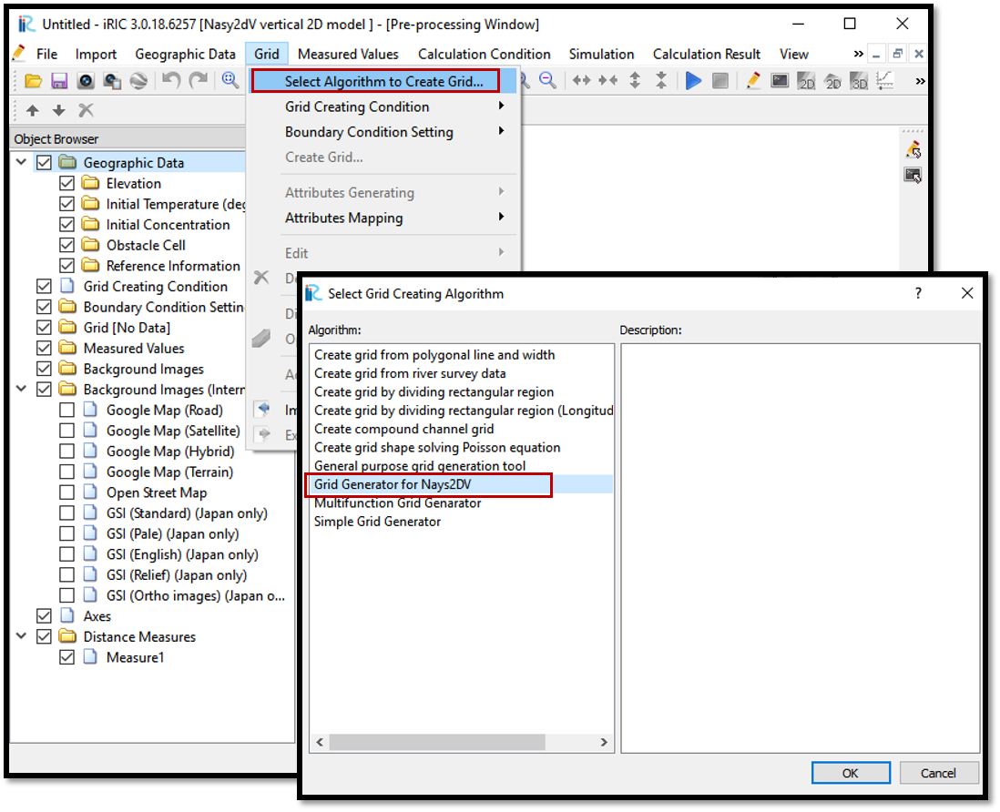

Creating grids for Nays2DV
===========================

Grid generation for Nays2DV should be done using grid generator for Nays2DV.

For that select, [Grid] then, [Select Algorithm to Create Grid] and
then [Grid Generator for Nays2DV] in [Select Grid Creating Algorithm] window as shown in :numref:`image_Grid_creation`. 

.. _image_Grid_creation:

   : Grid creation

Using grid generator for Nays2DV, it is possible to generate grids with flat bottom,sloped bottoms, perturbed bottom with a line, cosine curve and dune shape.
 
Adding additional inlets and outlets in upstream or downstream or both if needed are possible.

