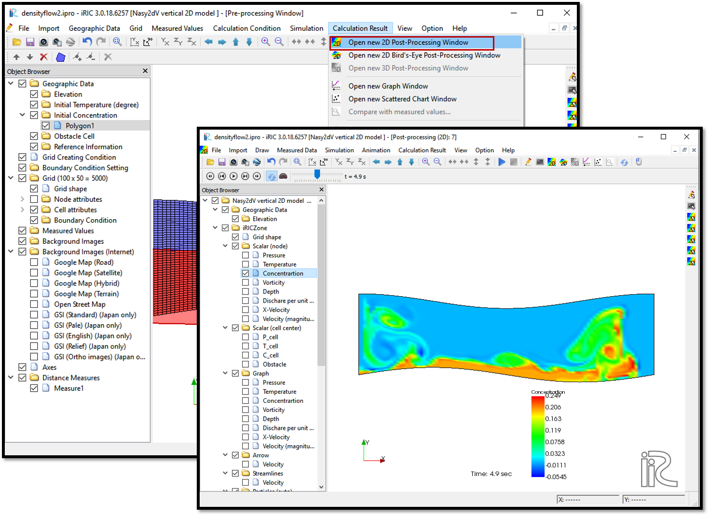

Visualization of results of Nays2DV in iRIC
============================================

After the simulation end, select [Calculation Results] and [Open new 2D Post-processing Window] or simply click on the 2D post-processing window icon. 

You will be directed to a window as shown in the :numref:`image_Viewing_results`.

Tick on any parameter in the object browser and adjust properties by right clicking on it. 

Animation of the variation can be seen with the animation icon.

.. _image_Viewing_results:

   : Visualization of results
