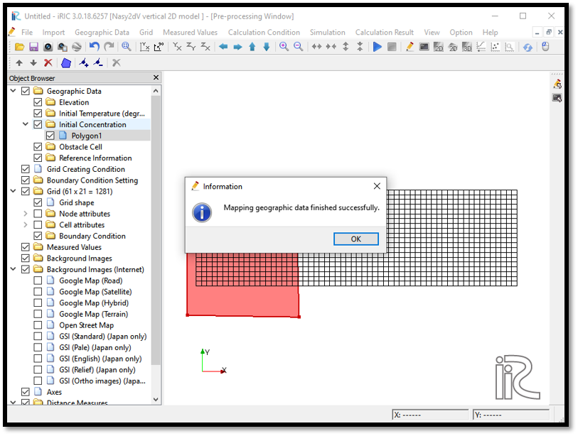

Example 01: Calculation of density currents in a tank
=========================================================

Purpose
---------
To understand the basic operation of Nays2DV in iRIC by calculating the current field due to the density difference in a closed tank.

Creation of the calculation grid and setting the initial conditions
--------------------------------------------------------------------
The grid for the Nays2DV model can be created only by using grid generator for Nays2DV. 

Select[Grid] [Select Algorithm to Create Grid] then select [Grid Generator for Nays2DV] as shown in :numref:`image_01_Grid-creation_1`. 

.. _image_01_Grid-creation_1:

   : Grid creation_1

Now the grid creation dialogue will appear as shown in :numref:`image_01_Grid-creation_2`. Since the bottom profile data is not not available, select how to set longitudinal bed profile as automatically. If longitudinal bed profile data available, select manually and give the data for longitudinal bed profile.

.. _image_01_Grid-creation_2:

   : Grid creation_2

Adjust the longitudinal details of the channel such as length and number of grids in x directions as required here. 
However, there is a maximum limit of the number of grids.

It is possible to adjust the bottom with a slope and perturb or non-perturb. This example a non perturbed bottom is used.
See in the example with a cosine shaped bottom for a case with a perturb bottom and water surface. 

If you have additional channels at upstream or downstream or both you can add here.

Water surface conditions and the number of grids in vertical direction can be given as shown in :numref:`image_01_Grid-creation_3`.

.. _image_01_Grid-creation_3:

   : Grid creation_3

Here you can adjust the water surface slope and shape perturb or non-perturb. 
If a flat one use non perturb and slope 0 as in this example. 
If you select perturb you can select either line, cosine or dune.

Background conditions of the creating grid can be given as shown in :numref:`image_01_Grid-creation_4`.

.. _image_01_Grid-creation_4:

.. figure:: images/01/01_Grid-creation_4.png
   :width: 400pt

   : Grid creation_4

Here give the values of the background temperature and concentration. This means the general condition of the calculation.

After setting up all the parameters create the grid.
Then you will be asked to map the attributes or not. 
Select yes, as shown in :numref:`image_01_Grid-creation_5`. 

However, later if new conditions of temperature, concentration etc are added,should execute the attribute mapping again.

.. _image_01_Grid-creation_5:

   : Grid creation_5

The grid is created as shown in :numref:`image_01_Grid-creation_6`.

.. _image_01_Grid-creation_6:

   : Grid creation_6

Now, add a new concentration using a polygon as shown in :numref:`image_01_Creating_initial_concentration_polygon_1`.
[Initial Concentration] [Add] [Polygon] when the plus mark appear draw the polygon as required.

.. _image_01_Creating_initial_concentration_polygon_1:

   : Creating initial concentration polygon_1

After drawing the polygon, edit the values of the initial concentration of the drawn polygon as shown in :numref:`image_01_Creating_initial_concentration_polygon_2`.

.. _image_01_Creating_initial_concentration_polygon_2:

   : Creating initial concentration polygon_2

In this example initial concentration is set to 0.03. 

Now the new concentration needs to be mapped to the grids using,
[Grid] [Attributes Mapping] and [Execute]. 

Then select the components needed to map. 
Select the parameters which changed the value. 
In this example it was initial concentration. 
Therefore, initial concentration is ticked as shown in :numref:`image_01_Attributes_mapping_1`.

.. _image_01_Attributes_mapping_1:

.. figure:: images/01/01_Attributes_mapping_1.png
   :width: 450pt

   : Attributes mapping_1

The confirmation of mapping window will appear as shown in :numref:`image_01_Attributes_mapping_2`.

.. _image_01_Attributes_mapping_2:

   : Attributes mapping_2

After successful mapping of the attributes, it can be seen from the cell attributes and node attributes. 

In this example check it in cell attributes.

In the [Object Browser] [Grid] [Cell Attributes] [Initial Concentration] as shown in :numref:`image_01_Attributes_mapping_check`.

.. _image_01_Attributes_mapping_check:

   : Attributes mapping check

As shown in the figure, initial concentration is mapped properly. 

Setting the calculation conditions and simulation
---------------------------------------------------
Next, calculation conditions need to be set. 

For that, select [Calculation Conditions] and [Settings].
 
Then the calculation conditions window will open as shown in :numref:`image_01_Setting_Calculation_conditions_1`. Input the values as shown in figure for computational parameters.

.. _image_01_Setting_Calculation_conditions_1:

   : Setting Calculation conditions_1

In this example, upstream and downstream boundary are closed boundary.

Then input parameters for time and iteration parameters as shown in :numref:`image_01_Setting_Calculation_conditions_2`. 

.. _image_01_Setting_Calculation_conditions_2:

   : Setting Calculation conditions_2 

Time and iteration parameters are important for simulation stability. 

Computational time step needs to be set considering the CFL condition according to the grid size.

If the computation fails at the initial stage, change the time step to a smaller value and try again.

Then adjust the physical parameters as shown in :numref:`image_01_Setting_Calculation_conditions_3`.

.. _image_01_Setting_Calculation_conditions_3:

   : Setting Calculation conditions_3 
 
Physical parameters need to be adjusted according to the fluids used. 
In this example default values are used.

After setting all the calculation parameters, save and close the window. 

Then save the project as density_currents.ipro and run the simulation with [Simulation]  [Run] as shown in :numref:`image_01_Simulation_1`.

.. _image_01_Simulation_1:

   : Simulation_1

The simulation will end as shown in :numref:`image_01_Simulation_2`.

.. _image_01_Simulation_2:

   : Simulation_2

Visualization of results
-------------------------

After the computation is stopped, results can be viewed from [Calculation Results] [Open new 2D Post-Processing Window] as shown in :numref:`image_01_Viewing_results_1` or by clicking on 2D post-processing window icon.

.. _image_01_Viewing_results_1:

   : Viewing results_1
 
The 2D post processing window will appear as shown in :numref:`image_01_Viewing_results_2`

.. _image_01_Viewing_results_2:

   : Viewing results_2

In post processing window, the parameters need to be viewed can be selected in object browser. 
By adjusting the properties to desired scales, results can be visualized nicely.
In this exmaple let's visualize concentration and velocity vectors.

To visualize concentration,tick in object browser [iRIC Zone],[Scale],[Concentration]. Then right click on [Concetration] and select [Property]. 
The [Scaler Setting] window will appear as shown in :numref:`image_01_Viewing_results_3`. 

.. _image_01_Viewing_results_3:

   : Viewing results_3

As shown in the above figure, untick the automatic in [Value Range] and give themaximum and minimum values. In this example set minimum to 0 and maximum to 0.03. Tick on fill upper area and fill lower area.

To visualize velocity vectors together, tick on [Arrow] and [Velocity] both and right click on [Arrow], then select [Property].

[Arrow Setting] window will appear as shown in :numref:`image_01_Viewing_results_4`. 

.. _image_01_Viewing_results_4:

   : Viewing results_4

Adjust the size of velocity vectors as shown in the figure.

Now the concentration and velocity vectors can be viewed as shown in :numref:`image_01_Concentration&velocity_vector_plot`. 

.. _image_01_Concentration&velocity_vector_plot:

   : Concentration and velocity vector plot

The animation of the movement can be viewed with animation buttons in top of the2D post-processing window.
