Example 02: Vertical 2D flow over continuous dunes
======================================================

Purpose
---------
Calculate the vertical 2D flow over the dunes and the particle movements.

Creation of the calculation grid and setting the initial conditions
------------------------------------------------------------------------
Create the grid using [Grid] [Select Algorithm to Create Grid] and then select [Grid Generator for Nays2DV] as shown in :numref:`image_02_Grid_creation_1`.

.. _image_02_Grid_creation_1:

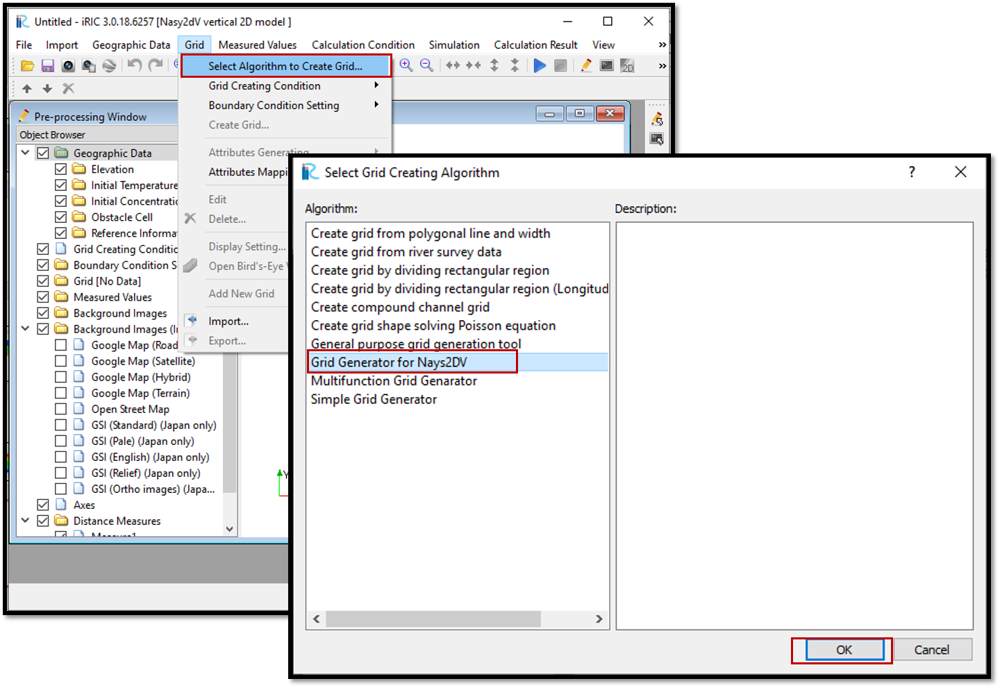

   : Grid creation_1

Then, give the channel bottom shape parameters as shown in :numref:`image_02_Grid_creation_2`. Since the bottom profile data is not not available, select how to set longitudinal bed profile as automatically. If longitudinal bed profile data available select manually and give the data for longitudinal bed profile.

.. _image_02_Grid_creation_2:

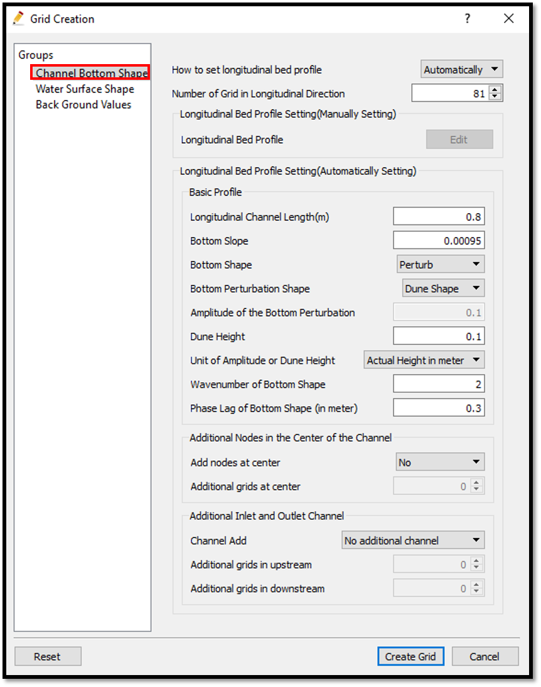

   : Grid creation_2

In this example, 
Channel length = 0.8 m, 
No of grids in x direction = 81,
Bottom slope =0.00095, 
Bottom shape is perturb, 
dune shape,
dune height=0.1,
Unit of amplitude or dune height is in m.

Wave number of bottom shape =2 and phase lag of bottom shape is 0.3 m.

In this example no additional inlet and outlet channels and no additional nodes in the center of the channel.

After that, give the water surface shape parameters and no of grids in vertical direction as shown in :numref:`image_02_Grid_creation_3`.

.. _image_02_Grid_creation_3:

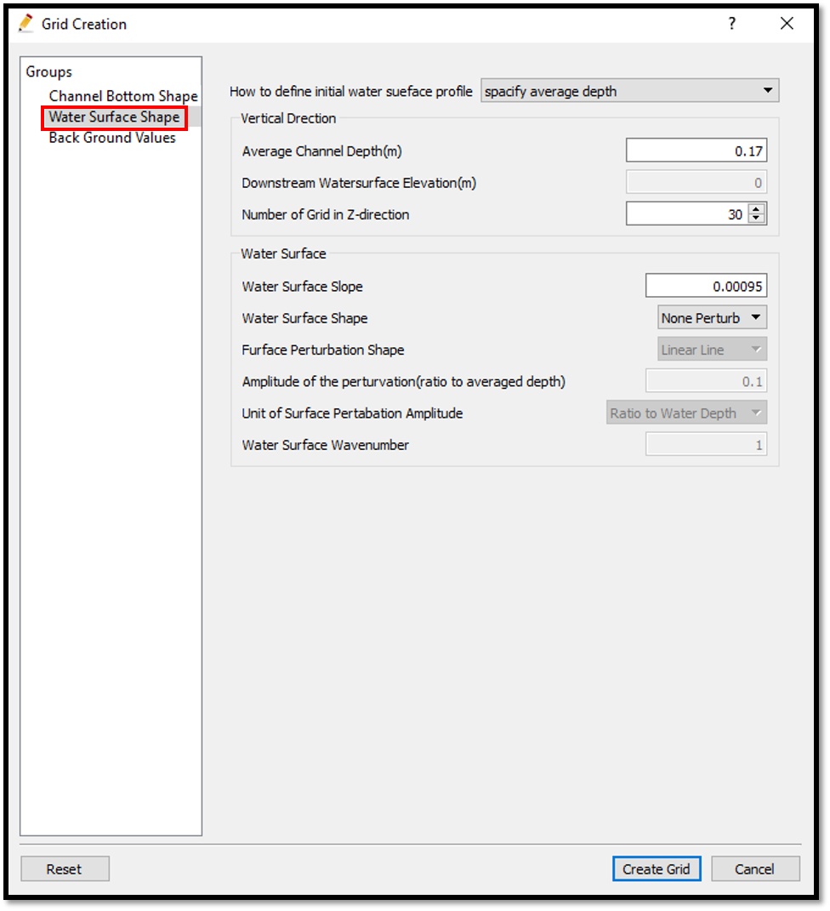

   : Grid creation_3

Water depth and no of grids in vertical directions are given here. 
Average channel depth = 0.17,
No of grids in Z directions = 30.

Water surface shape and slope are adjusted as,
Water surface slope=0.00095,
Water surface shape = non perturb

Then, background values are given as shown in :numref:`image_02_Grid_creation_4`.

.. _image_02_Grid_creation_4:

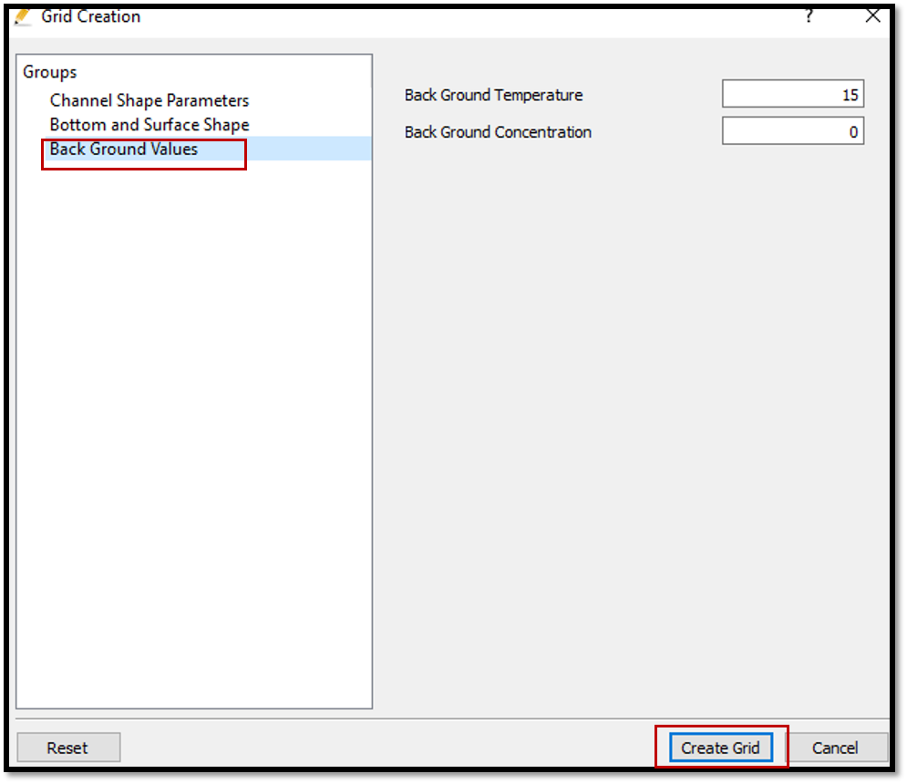

   : Grid creation_4

Back ground temperature is given as 15 and background concentration is 0. 

After selecting [Create Grid], program will ask whether to map attributes to thegrid or not. You can either map the attributes now or can do it again before the simulation.

The created grid is as shown in :numref:`image_02_Created_grid`.

.. _image_02_Created_grid:

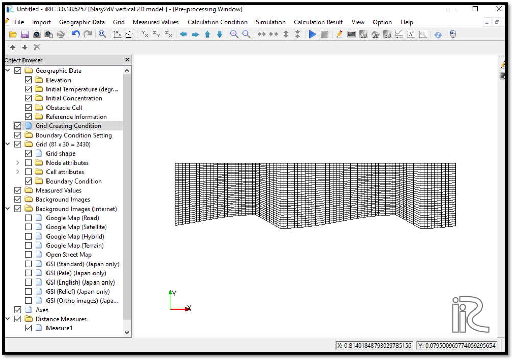

   : Created grid

After the grid creation and attributes mapping, check the mapped attributes by ticking on [Grid] in [Object Browser] and selecting the mapped attributes in cell attributes drop down list. 
 
If needed, it's possible to adjust attribute values here. In this example no adjustments are made.

Now save the project from,
[File] [Save as file.irpo] or [Save as Project] as shown in :numref:`image_02_Saving_the_project`. 
If the project is saved as .ipro, all the files are in one file and just by clicking on it, it will open with iRIC automatically. 

If the project is saved as a project, there will be several folders and iRIC should open first and then the project xml file has to open in iRIC.

.. _image_02_Saving_the_project:

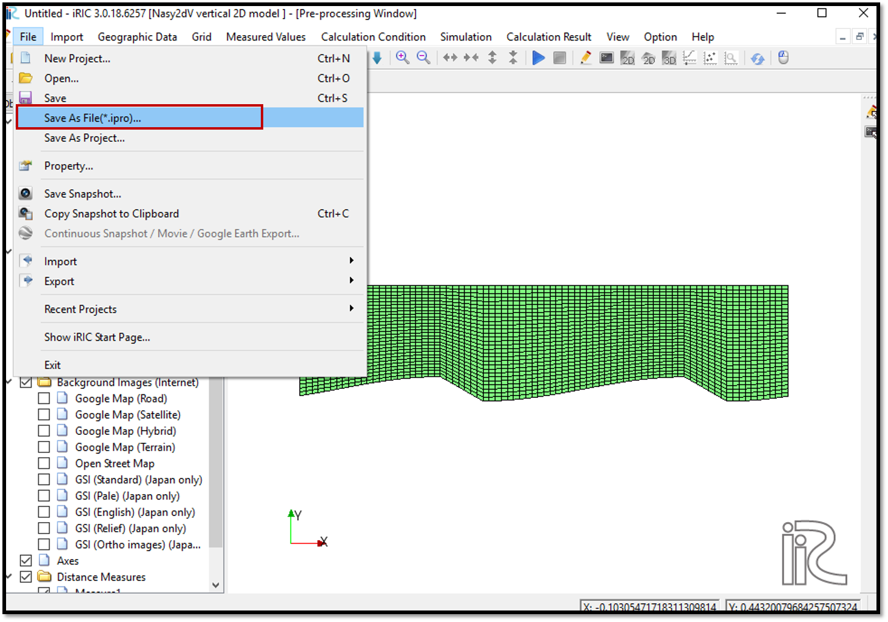

   : Saving the project

Setting the calculation conditions and simulation
---------------------------------------------------
To set the calculation conditions, Select [Calculation Condition] and then select [Settings]. 
Calculation condition window will appear as shown in :numref:`image_02_Calculation_condition_setting_1`. 
Computational parameters, time and iteration parameters and physical parameters need to set here.

.. _image_02_Calculation_condition_setting_1:

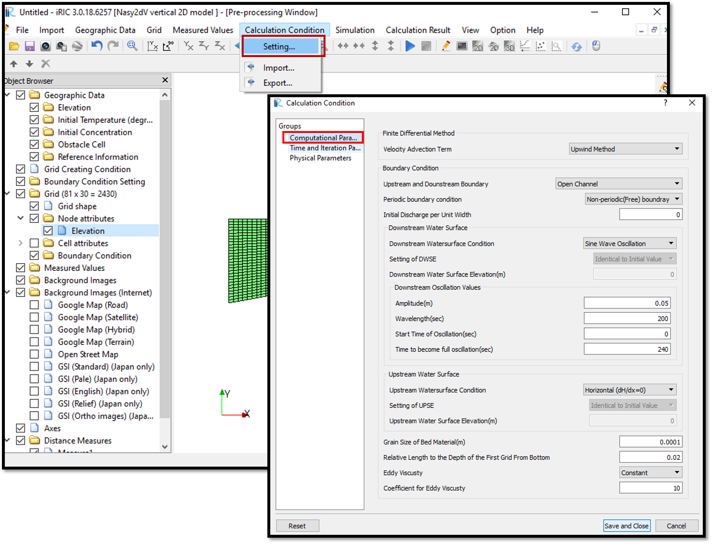

   : Calculation condition setting_1

For boundary condition, 
upstream and downstream boundary are set as open channel flow with periodic boundary. 

Averaged velocity=0.3, averaged depth=0.17, grain size of bed material =0.0001, relative length to the depth of the first grid from bottom =0.02, 
eddy viscosity=constant, coefficient for eddy viscosity=1.

Time and iteration parameters are set as shown in :numref:`image_02_Calculation_condition_setting_2`.

.. _image_02_Calculation_condition_setting_2:

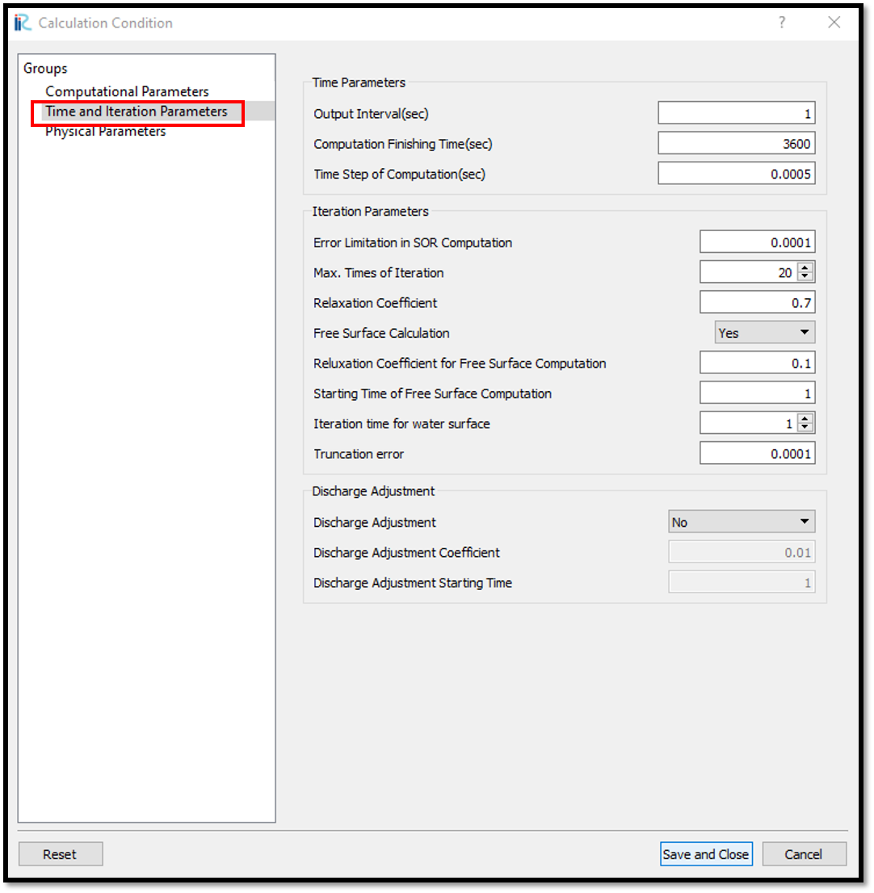

   : Calculation condition setting_2
  
Time parameters are, output interval=0.01, computation finishing time=5 s, 
time step of computation = 0.001. 
Free surface calculation is included.

Discharge adjustment is included.

After that, physical parameters are set as shown in :numref:`image_02_Calculation_condition_setting_3`.

.. _image_02_Calculation_condition_setting_3:

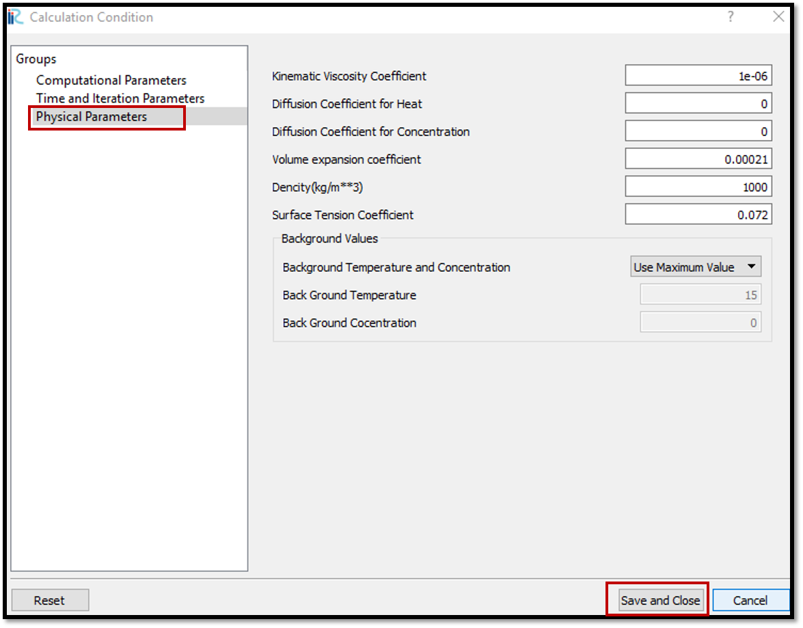

   : Calculation condition setting_3 

For the physical parameters default values are used.

After setting the calculation conditions, save the project again.

Then, start the simulation with [Simulation] [Run] as shown in :numref:`image_02_Simulation_1`.

.. _image_02_Simulation_1:

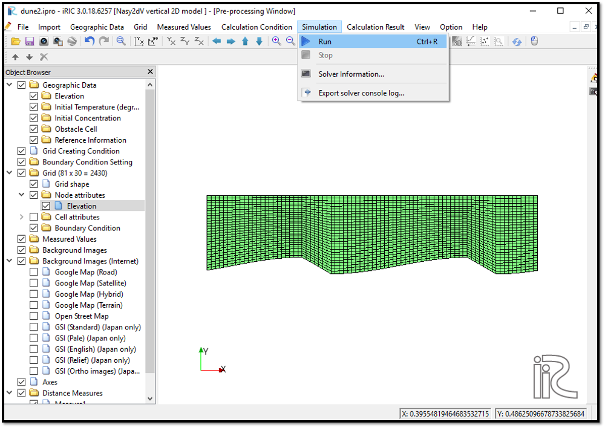

   : Simulation_1

At the end of the simulation, a message box will appear as shown in :numref:`image_02_Simulation_2` saying 'solver finished the calculation'.

.. _image_02_Simulation_2:

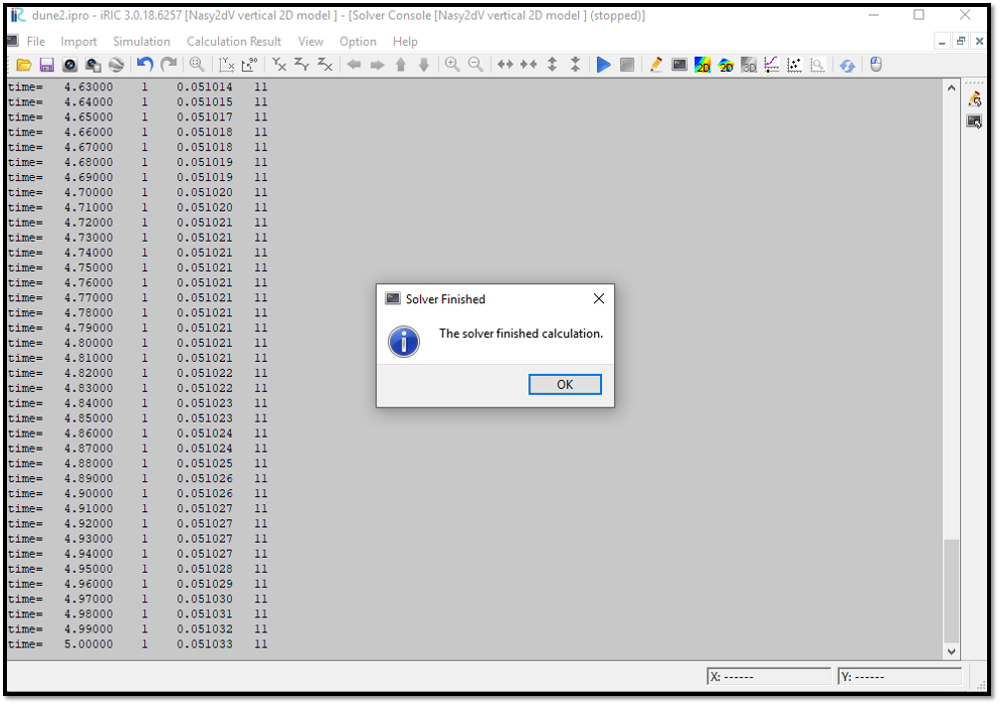

   : Simulation_2

Visualization of results
-------------------------
After the solver finished the calculation, view the results by,
[Calculation Results] [Open 2D Post-Processing Window] as shown in 
:numref:`image_02_Viewing_results_1` or simply by clicking on Open 2D post-processing window icon.

.. _image_02_Viewing_results_1:

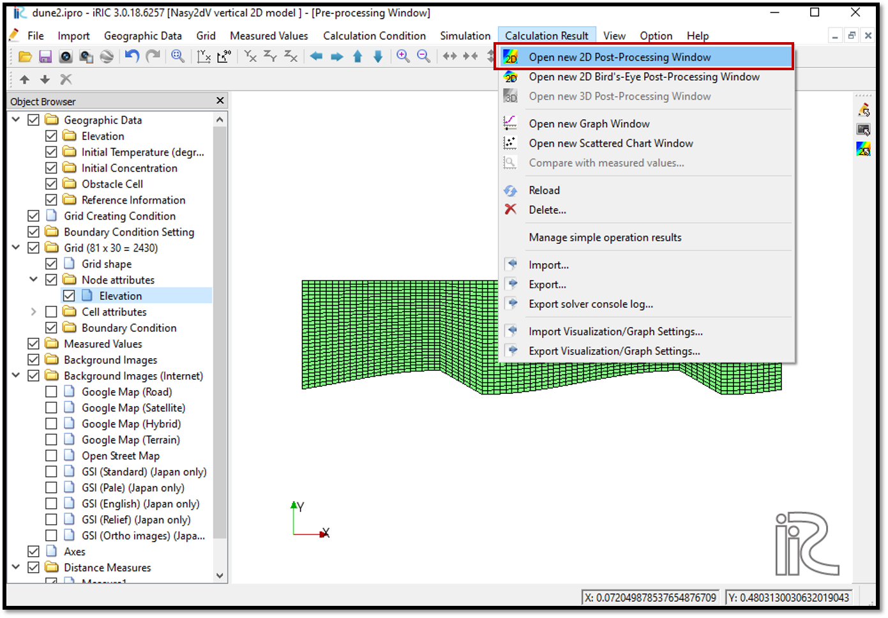

   : Viewing results_1

Tick on [iRIC Zone],[Scalers], [Vorticity] in [Object Browser] and right click on [Vorticity] and select [Property] as shown in :numref:`image_02_Viewing_results_2`. 

Then it is possible to adjust the legend and the visible range of the data.

.. _image_02_Viewing_results_2:

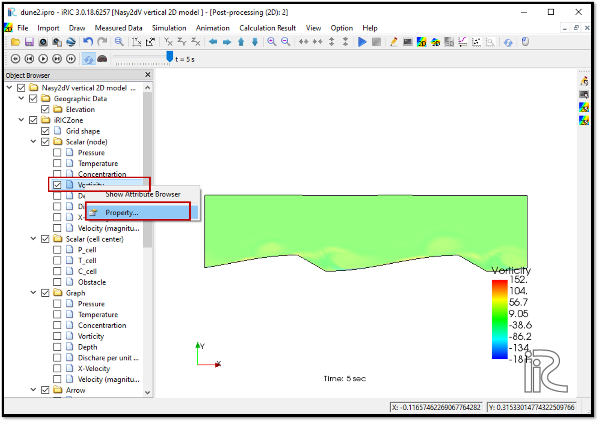

   : Viewing results_2

Then the scaler setting will appear as shown in :numref:`image_02_Viewing_results_3`. 

In the scaler setting window, unselect the automatic in value range and give minimum as -20 and maximum as 20. 
Then adjust the colour map by selecting custom setting.

In custom color map adjust the type to three colors and select the three colours as red, white and blue respectively.

.. _image_02_Viewing_results_3:

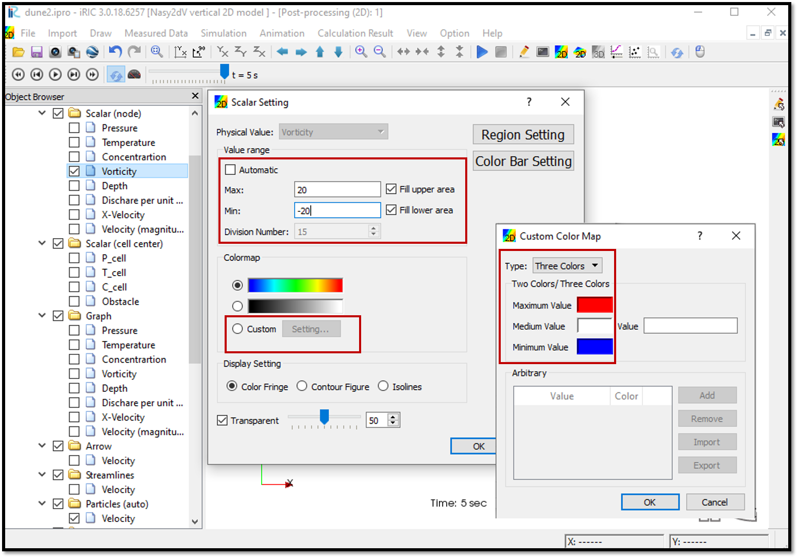

   : Viewing results_3

The particles can be added by ticking on [Particles] and [Velocity] in [Object Browser]. The particle can be adjusted with property. 

Right click on [Particles] and select [Property]. [Particle Setting] window will appear as shown in :numref:`image_02_Viewing_results_4`

.. _image_02_Viewing_results_4:

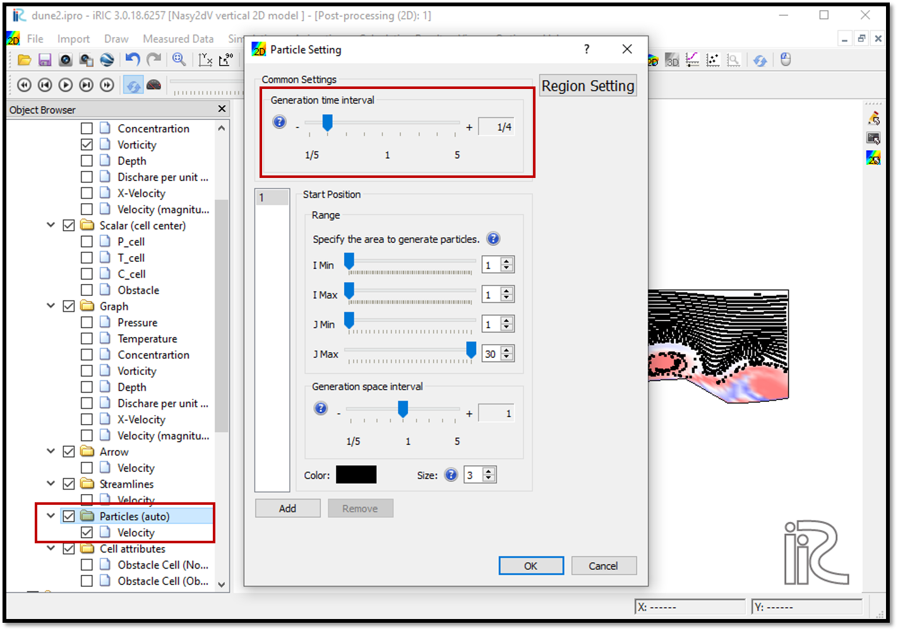

   : Viewing_results_4

In this example generation time interval is set as 1/4 and others keep as default values.

The resulting figure is as shown in :numref:`image_02_Vorticity&particle_movement`

.. _image_02_Vorticity&particle_movement:

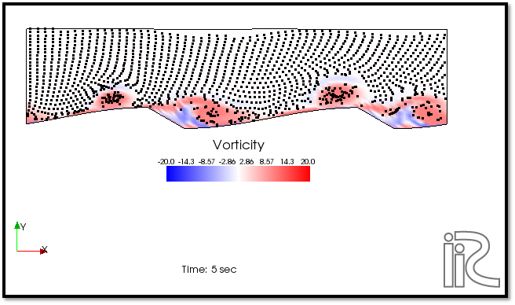

   : Vorticity & particle movement

The animation of the movement can be viewed with animation buttons in top of the 2D post-processing window.
