[計算例 3] 密度の重い流体による下降流と混合
============================================================================

プールのような長方形の空間中央上部に周囲より密度の大きな流体が置かれた状態を初期条件として
その後の流体および密度混の挙動をシミュレーションする。

--------------
計算格子の生成
--------------

計算格子の作成はNays2dv専用の格子生成ツールを用いる。 :numref:`03_03_koshi_1` 
で[Nay2dv用格子生成ツール]を選択し。[OK]をクリックする。

.. _03_03_koshi_1:

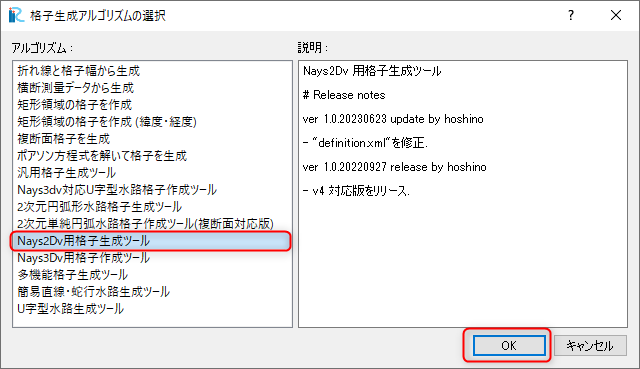

   : 格子生成アルゴリズムの選択

下図の :numref:`03_03_koshi_2` で赤囲いの部分を設定すし、「グループ」「水面形」に移動する。

.. _03_03_koshi_2:

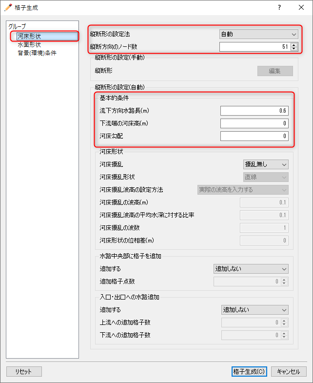

   : 格子生成: 計算領域

下図 :numref:`03_03_koshi_3` で赤囲いの部分を設定し、[格子生成]をクリックすると :numref:`03_03_koshi_4`
が現れ、「マッピングしますか？」と聞かれるので、[はい(Y)]を選択すると、格子生成が完了する。

.. _03_03_koshi_3:

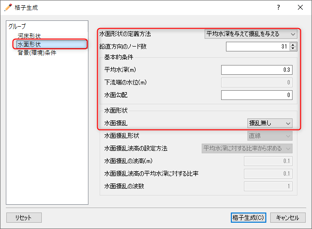

   : 格子生成： 縦断形の手動入力

.. _03_03_koshi_4:

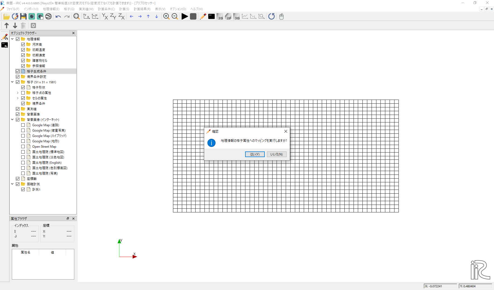

   : マッピング

--------------
初期濃度の設定
--------------

下の動画 :numref:`03_03_nodo` に示す要領で、オブジェクトブラザーで[格子][セルの属性][初期濃度]
にチェックマークを入れ、対象領域の中央上部の長方形範囲を選んで、右クリック[値の編集]で「初期濃度」
を指定する。ここでは[0.03]を入力する。

.. _03_03_nodo:

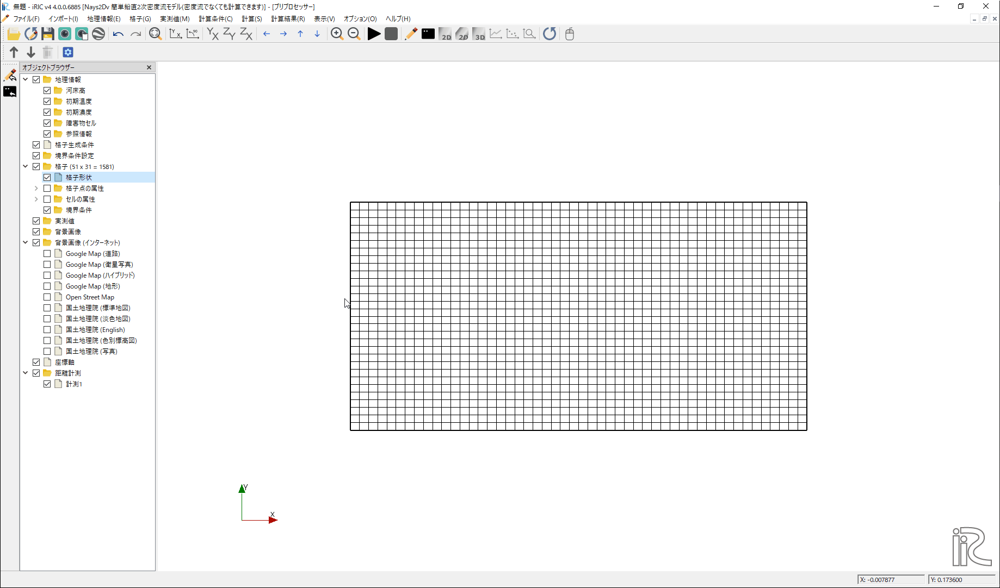

   : 初期濃度の設定

--------------
計算条件の設定
--------------

メニューバーから[計算条件]→[設定]を選ぶと「計算条件」入力用のウィンドウが表示される :numref:`03_03_joken_1` 

.. _03_03_joken_1:

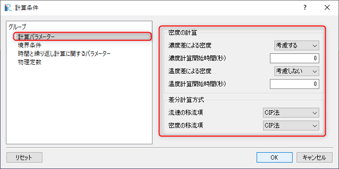

   : 計算パラメータ

「計算条件」ウィンドウ :numref:`03_03_joken_1` の「モデルパラメータ」は図の赤で囲った部分を設定する。
本計算は濃度の違いによる密度流なので、「濃度差による密度」を[考慮する]に設定する。

.. _03_03_joken_2:

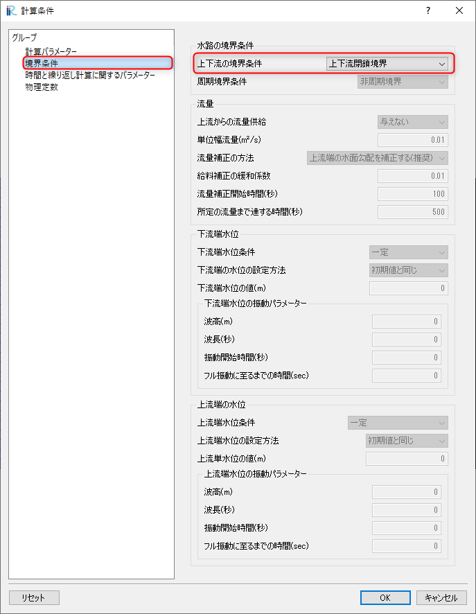

   : 境界条件

「計算条件」の「境界条件」は、長方形の閉鎖水域を対象としているので、
:numref:`03_03_joken_2` の赤囲いのように[上下流閉鎖境界]で設定する。

.. _03_03_joken_3:

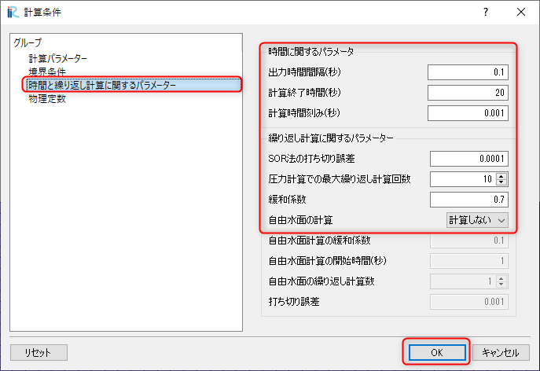

   : 時間および繰り返し計算パラメーター

「計算条件」の「時間およに繰り返し計算パラメーター」は、
:numref:`03_03_joken_3` の赤囲いのように設定する。自由水面の計算は[しない]に設定する。

設定が終了したら、[保存して閉じる]を押す。

------------
計算の実行
------------

.. _03_03_jikko_1:

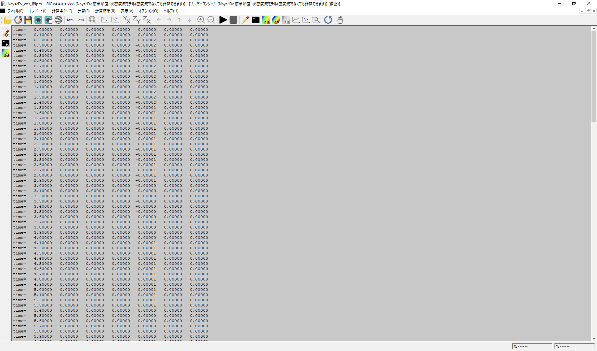

   :計算実行中の画面

[計算]→[実行]を指定すると、:numref:`03_03_jikko_1` のような画面が現れ計算が始まる。

.. _03_03_jikko_2:

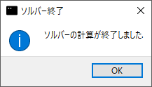

   :計算の終了

計算が終了すると、:numref:`03_03_jikko_2` のような表示がされるので。[OK]をクリックする。

-------------------------
計算結果の表示
-------------------------

計算の終了後、[計算結果]→[新しい可視化ウィンドウ(2D)を開く]を選ぶことによって、
可視化ウィンドウ(2D)が現れる。( :numref:`03_03_kekka_1` )

.. _03_03_kekka_1:

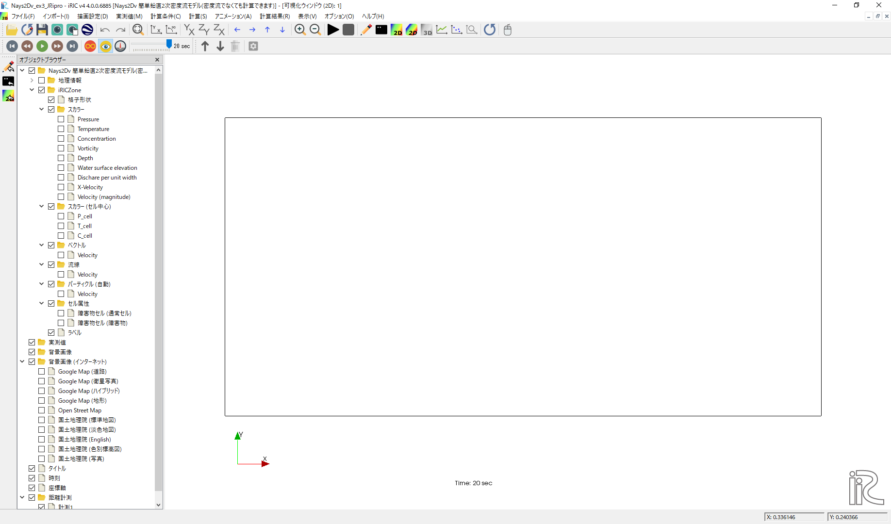

   : 計算結果の表示(1)
 

マウスのセンターダイヤを回すことにより拡大・縮小が可能となっている。

^^^^^^^^^^^^^^^^^^^^^^
濃度コンター表示の設定
^^^^^^^^^^^^^^^^^^^^^^

オブジェクトブラウザーで、[スカラー][Concentration]にチェックマークを入れて右クリックして、
[プロパティ]をクリックすると、「スカラー設定」ウィンドウ :numref:`03_03_kekka_3` が現れる。

.. _03_03_kekka_3:

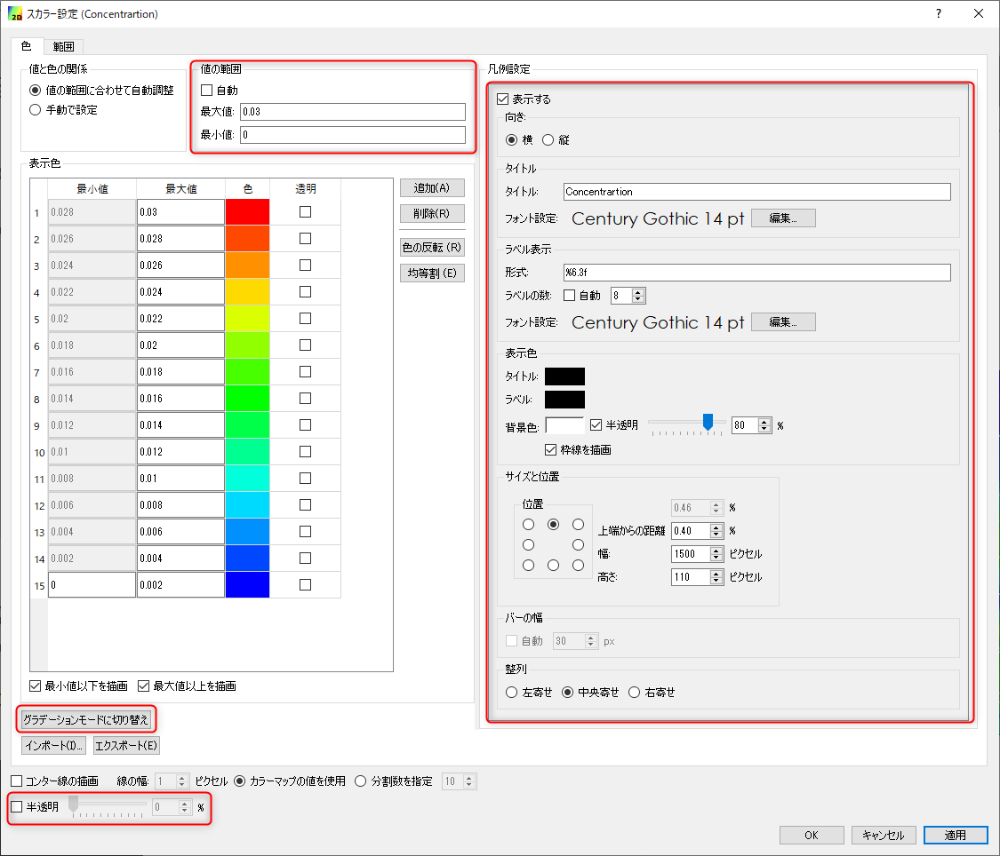

   : スカラーの設定
 

:numref:`03_03_kekka_3` のようにスカラーに関する各パラメータを設定し、[OK]ボタンを押す。

 
^^^^^^^^^^^^^^^^^^^^^^^^^^^^
パーティクル表示の設定
^^^^^^^^^^^^^^^^^^^^^^^^^^^^

オブジェクトブラウザーで、[パーティクル][流速]に☑を入れ、[パーティクル]を右クリックして、
「パーティクル設定」ウィンドウを表示させせる。その後、「任意のタイミングで生成」「編集」
「パーティクル」[タイムステップの追加]を選び[0sec]を指定する。
この後、「パーティクルの発生範囲」と「色」「サイズ」を調整して[OK]を押す。
（具体的手順は :numref:`03_03_kekka_5` を参照）

.. _03_03_kekka_5:

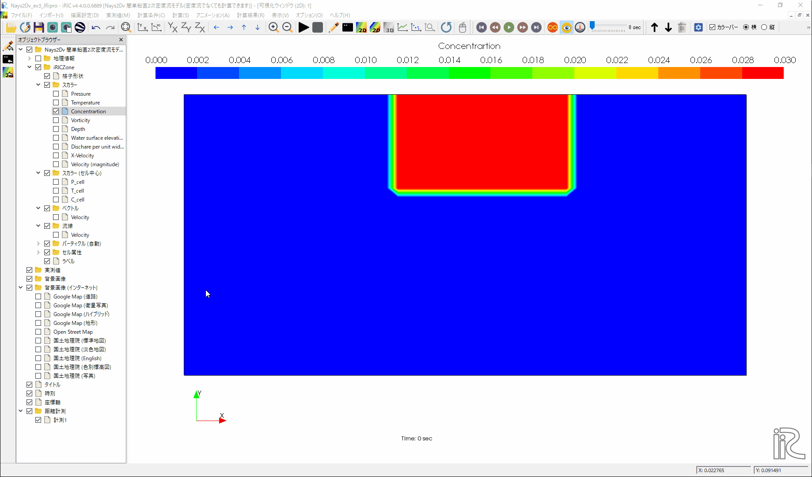

   : パーティクルの設定

^^^^^^^^^^^^^^^^^^^^^^^^^^^^^^^^^^
計算結果の表示およびアニメーション
^^^^^^^^^^^^^^^^^^^^^^^^^^^^^^^^^^

「可視化ウィンドウ(2D)」 :numref:`03_03_kekka_6` でタイムバーをゼロに戻して、[アニメーション]→[開始/停止]で
計算結果をアニメーションで見ることが出来る。

.. _03_03_kekka_6:

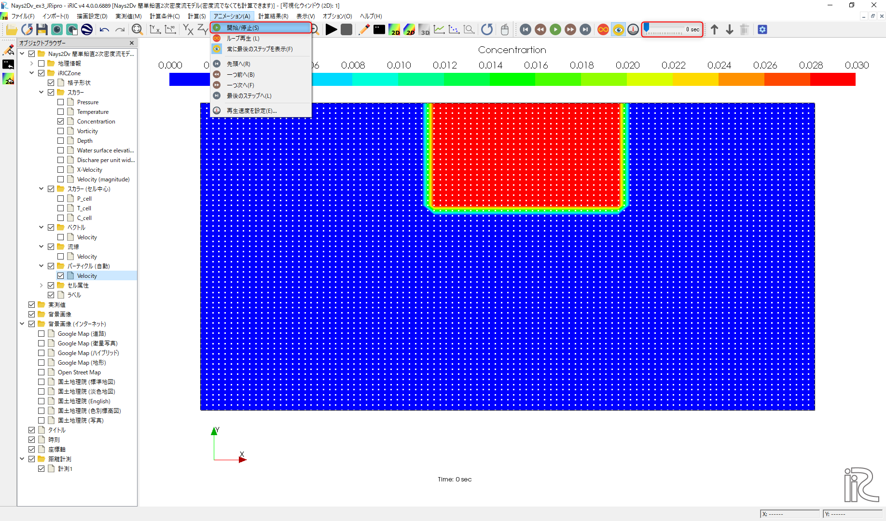

   : アニメーションの開始/停止
 

.. figure:: images/03/ex3.gif