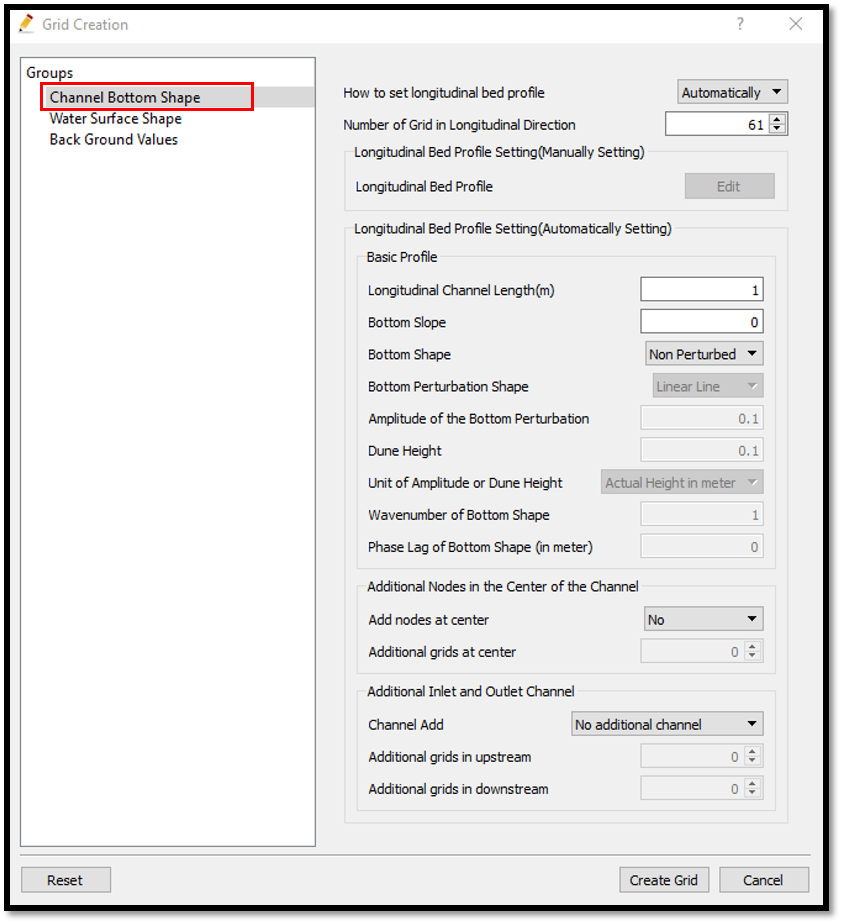
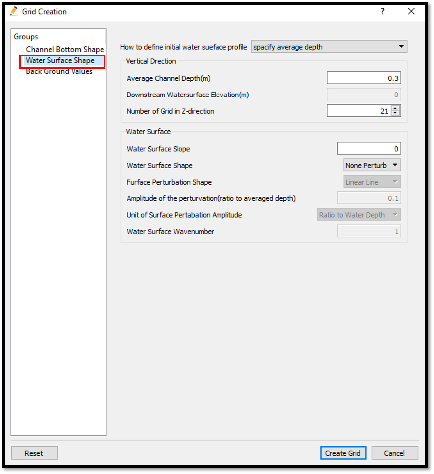

Example 03: Heat transport from a heat boundary
===================================================

Purpose
---------
Calculate the transportation of heat in a closed rectangular tank when a temperature boundary is created.

Creation of the calculation grid and setting the initial conditions
------------------------------------------------------------------------
As explained in the other examples and the introduction, create the grid using, [Grid], [Select Algorithm to Create Grid] and then select [Grid Generator for Nays2DV].
Then the grid creation window will appear.

In grid creation window, select the channel bottom shape parameters as shown in :numref:`image_03_Grid_creation_1`. Since the bottom profile datails are not not available, select how to set longitudinal bed profile as automatically. If longitudinal bed profile data available select manually and give the data for longitudinal bed profile.

.. _image_03_Grid_creation_1:

   : Grid creation_1

For the water surface shape parameters, and average channel depth and number of girds in vertical direction, select as shown in :numref:`image_03_Grid_creation_2`. Since a non purturbed surface and bottom are selected here, no adjustment are needed.

.. _image_03_Grid_creation_2:

   : Grid creation_2

For the background values, select as shown in :numref:`image_03_Grid_creation_3`.

.. _image_03_Grid_creation_3:

.. figure:: images/03/ 03_Grid_creation_3.png
   :width: 400pt

   : Grid creation_3

For the background values, use the default values of background temperature 15 and background concentration 0. 

The grid is created and dialogue box will open asking whether to map the attributes or not. Select yes and it will map the attributes.

The create a temperature boundary, select [Boundary Conditions Setting] in [Object Browser] and [Add T_bound] as shown in :numref:`image_03_Add_Temperature_boundary`.

.. _image_03_Add_Temperature_boundary:

.. figure:: images/03/ 03_Add_Temperature_boundary.png
   :width: 450pt

   : Add Temperature boundary.
 
Then a T-bound will be created and a polygon for the T-boundary has to be drawn.The condition of the T_bound can be adjusted by right clicking on [T_bound] and [Edit condition] then editing the [Boundary Condition] window as shown in :numref:`image_03_Editting_Temperature_boundary`.

.. _image_03_Editting_Temperature_boundary:

.. figure:: images/03/ 03_Editting_Temperature_boundary.png
   :width: 450pt

   : Editting Temperature boundary.

After creating the T_Boundary, map the attribute to the grid. 

For the attribute mapping , select  [Grid], [Attributes Mapping], [Execute]. 

Then the attribute mapping window will appear. Tick on [New T-bound] and [OK] as shown in :numref:`image_03_Attributes_mapping`.

.. _image_03_Attributes_mapping:

.. figure:: images/03/ 03_Attributes_mapping.png
   :width: 450pt

   : Attributes mapping.

The T_Bound attribute is mapped to the grid. 

The mapping can be confirmed by checking the object browser.

Tick on [Grid] [Boundary Condition] and the [New T_Bound]. 

If the mapping is correct the name of the T_Bound, in this example [New T_Bound ] should appear on the grid as shown in :numref:`image_03_Check_attributes_mapping`.

.. _image_03_Check_attributes_mapping:

.. figure:: images/03/ 03_Check_attributes_mapping.png
   :width: 450pt

   : Check attributes mapping

This shows the correct mapping of the New T_Bound to the grid. 

Save the project with [File], [Save as .ipro] or [Save as Project]. 

Setting the calculation conditions and simulation
---------------------------------------------------
Set the calculation conditions with, [Calculation Condition], [Setting].

Calculation condition window will open. 

Set computational parameters as shown in :numref:`image_03_Setting_calculation_conditions_1`.

.. _image_03_Setting_calculation_conditions_1:

.. figure:: images/03/ 03_Setting_calculation_conditions_1.png
   :width: 450pt

   : Setting calculation conditions_1

Set time and iteration parameters as shown in :numref:`image_03_Setting_calculation_conditions_2`.

.. _image_03_Setting_calculation_conditions_2:

.. figure:: images/03/ 03_Setting_calculation_conditions_2.png
   :width: 450pt

   : Setting calculation conditions_2

Set physical parameters as shown in :numref:`image_03_Setting_calculation_conditions_3`.

.. _image_03_Setting_calculation_conditions_3:

.. figure:: images/03/ 03_Setting_calculation_conditions_3.png
   :width: 450pt

   : Setting calculation conditions_3

After setting the calculation conditions, save and close the calculation condition window. 

Save the project again. Now start the simulation by [Simulation], [Run].

Visualization of results
-------------------------
After calculation solver stopped, go to [Calculation results], [Open new 2D Post-Processing Window].

Tick on [iRIC zone], [Scaler] and [Temperature] in [Object Browser]. 

Right click on [Temperature] select [Property]. 

[Scaler Setting] window will appear and adjust the scaler value range for visibility as shown in :numref:`image_03_Visualization_of_results_1`.

.. _image_03_Visualization_of_results_1:

.. figure:: images/03/ 03_Visualization_of_results_1.png
   :width: 450pt

   : Visualization of results_1

To see the velocity vector movement tick on [Arrow] and [Velocity] in object browser. 
Arrow properties can be adjusted by right clicking on [Arrow] and selecting [Property]. 

Arrow setting window will appear and the sizes of the arrow can be adjusted as shown in :numref:`image_03_Visualization_of_results_2`.

.. _image_03_Visualization_of_results_2:

.. figure:: images/03/ 03_Visualization_of_results_2.png
   :width: 350pt

   : Visualization of results_2

The resulting figure is as shown in :numref:`image_03_Temperature&velocity_vector_plot`.

.. _image_03_Temperature&velocity_vector_plot:

.. figure:: images/03/ 03_Temperature_velocity_vector_plot.png
   :width: 350pt

   : Temperature & velocity vector plot
