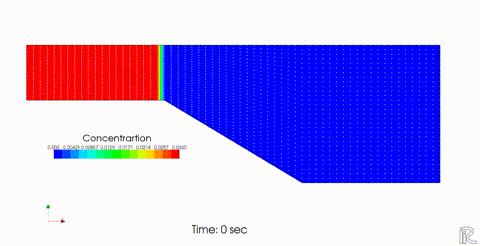

.. Nays2DV example manual documentation master file, created by
   sphinx-quickstart on 12 Jan 2021.
   You can adapt this file completely to your liking, but it should at least
   contain the root `toctree` directive.

Nays2DVマニュアル・事例集のページへようこそ!
==================================================

.. toctree::

   01_Introduction
   02_Overview
   03_Examples
   04_Reference

.. figure:: images/yasu.png
   :align: center
   :width: 200pt
   :target: https://rivmodel.rivpac.com/

.. figure:: images/iric.jpg
   :align: center
   :width: 200pt
   :target: https://i-ric.org/