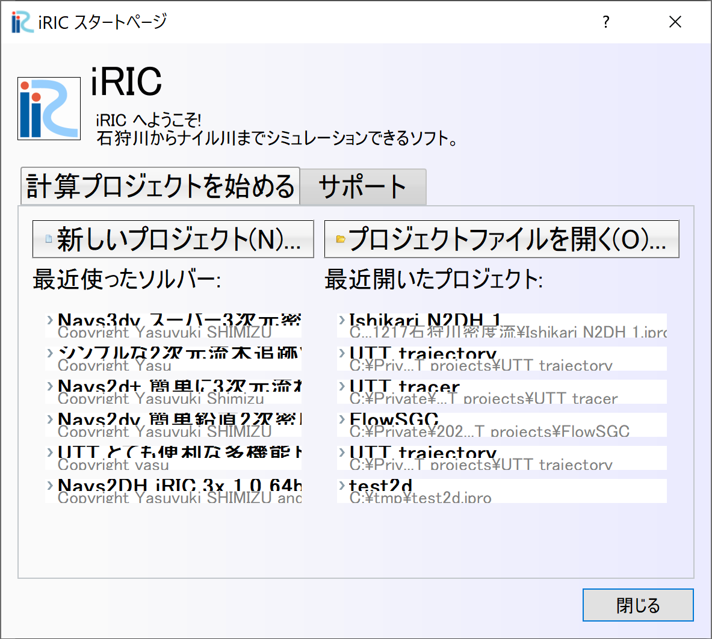
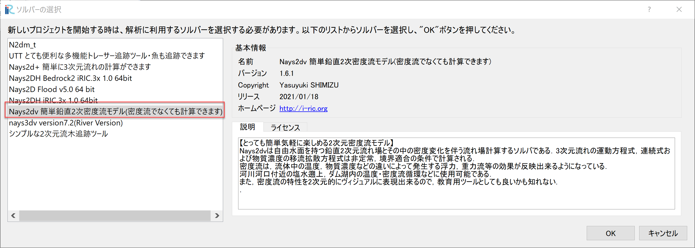
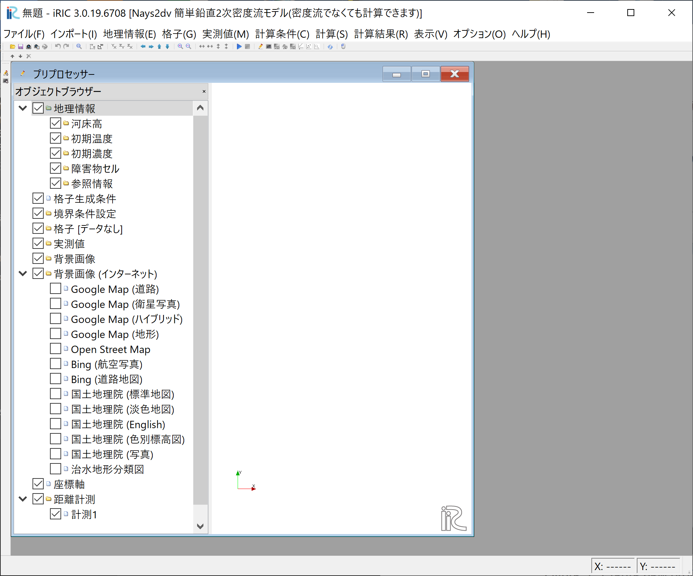

概要
============

Nays2DVにおける主な操作手順は以下のとおりである、 

Nays2DVの起動
--------------

iRIC上でのNays2DVの起動は以下の通りである。

iRICを起動し、以下の画面で[新しいプロジェクト(N)] をクリックする。

.. _image_create_new_project_1:

   : Create new project_1 

[ソルバーの選択] の画面 :numref:`image_create_new_project_2`. で 
[Nays2dv簡単鉛直2次元モデル] をクリックし[OK]をクリックする.

.. _image_create_new_project_2:

   : Create new project_2 

タイトルバーに 無題-iRIC 3.x.xx.xxxxと書かれた [Nays2dv 簡単鉛直2次元モデル] と書かれた画面が現れ 
:numref:`image_create_new_project_4`.

.. _image_create_new_project_4:

   : Create new project_4

Nays2dvの使用準備が完了となる。

この後、下記の手順となるが、実際の操作方法は次章の計算事例集で説明する。

・格子の作成

・計算条件設定

・計算実行

・計算結果を表示
