[計算例 1]長方形水槽における自由水面の振動
==============================================

Nays2dvを使って閉鎖水域(長方形の水槽)の自由水面の挙動のシミュレーションを行う。
ここでは、長方形形状の水槽の水面にコサインカーブの初期擾乱を与えて、その振動の様子を
観察する。

---------------
ソルバの選択
---------------

iRICの起動画面から、[新しいプロジェクト]を選ぶと表示されるソルバの選択画面で、
[Nays2dv簡単鉛直2次元密度流モデル]を選んで[OK]ボタン押すと、

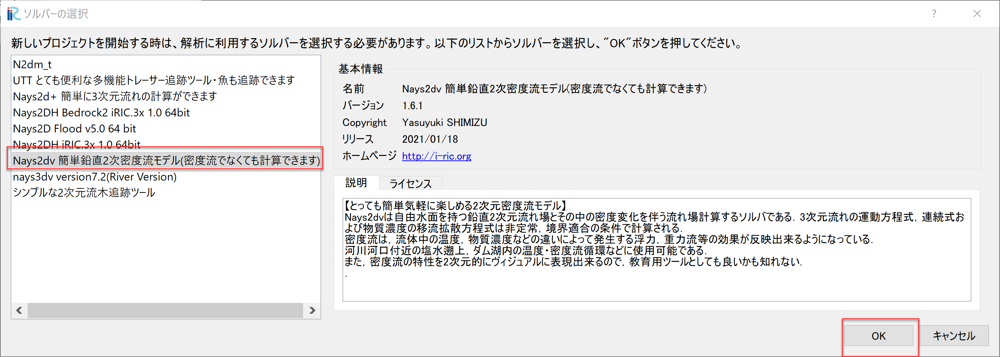

   : ソルバーの選択

「無題- iRIC 3.x.xxxx [Nays2dv簡単鉛直2次元密度流モデル]」と書かれた
Windowが現れる。

.. _01_mudai:

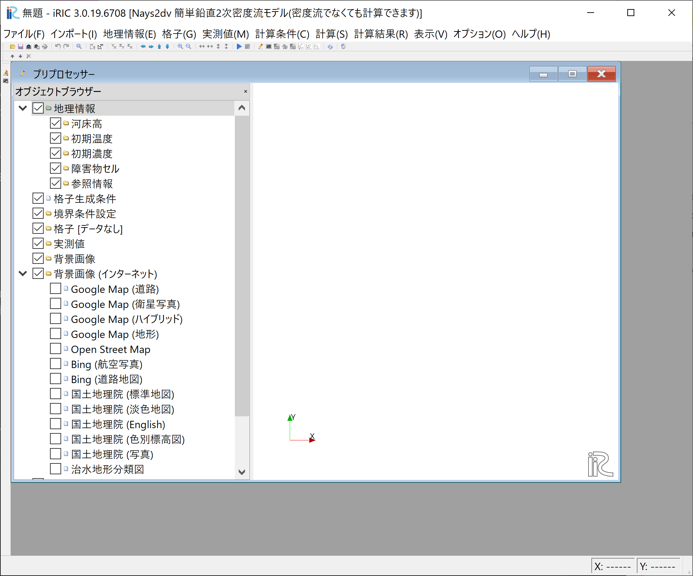

   : 無題

計算格子の作成はNays2dv専用の格子生成ツールを用いる。:numref:`01_mudai` 
のウィンドウで、[格子]→[格子生成アルゴリズムの選択]から現れる、
「格子生成アルゴリズムの選択」ウィンドウ で[Nays2dv用格子生成ツール]を選んで[OK]を押す。

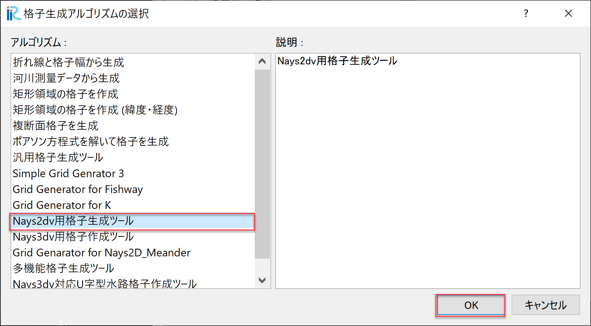

  : 格子生成アルゴリズムの選択

--------------
計算格子の作成
--------------

.. _02_koushi_1:

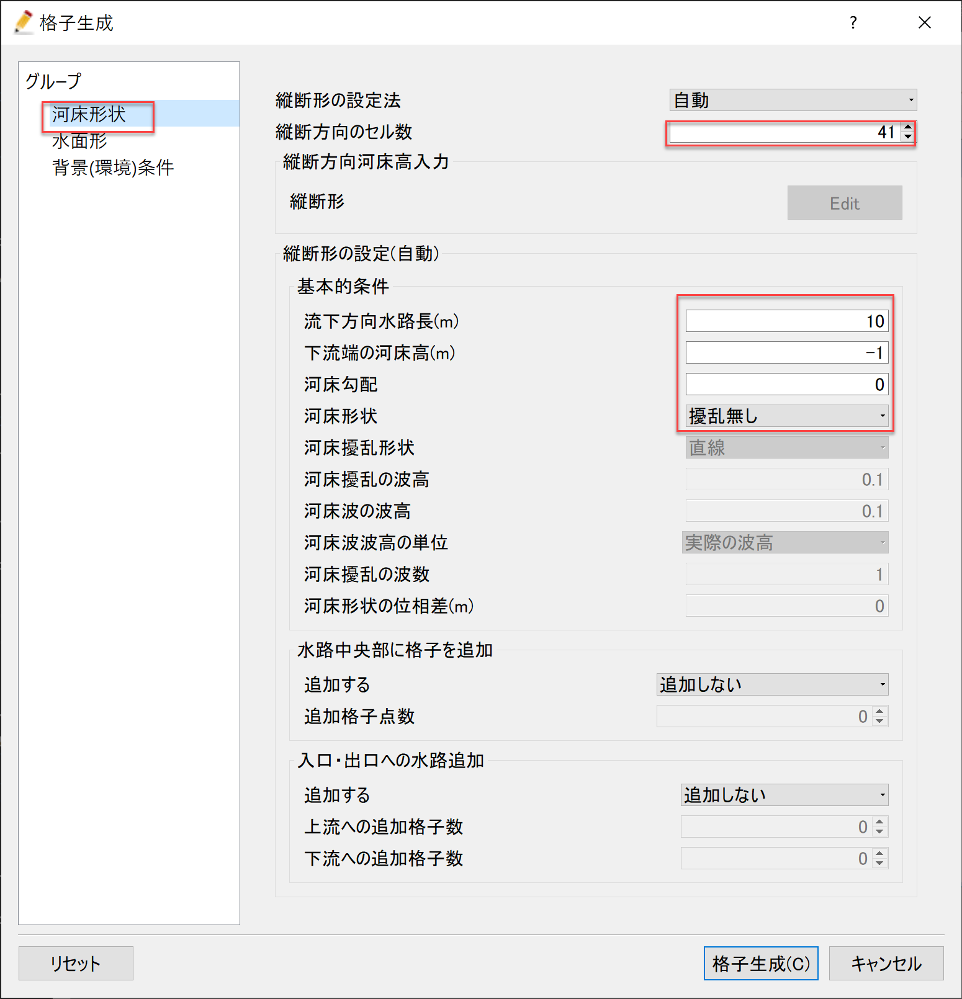

   :格子生成(計算領域)形状

:numref:`02_koushi_1` の画面で、[グループ]で[河床形状]を選び。「縦断方向のセル数」を[41], 
「流下方向水路長(m)」を[10],
「下流端の河床高(m)」を[-1], 「河床勾配」を[0], 
「河床形状」を[擾乱無し]とする。入力が終わったら「水面形」のグループへ
移動する。

.. _03_koushi_2:

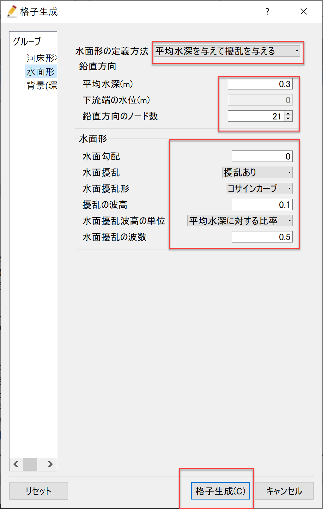

   :格子生成(計算領域)形状

:numref:`03_koushi_2` の画面で、「水面形の定義方法」を[平均水深を与えて擾乱を与える],
「平均水深(m)」を[0.3], 「鉛直方向のノード数」を[21], 「水面勾配」を[0],
「水面擾乱」を [擾乱あり],「水面擾乱形」を[コサインカーブ], 
「擾乱の波高(m)」を[０.1], 擾乱波数を[0.5]として、最後に[格子生成]ボタンを押す。

.. _04_koushi_3:

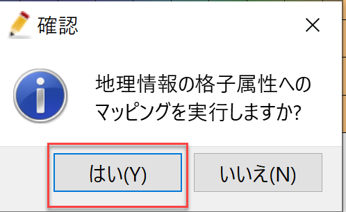

   :確認(マッピング)

すると、:numref:`04_koushi_3` 確認ウィンドウが現れるので,[はい(Y)]を押すと格子が生成され、
下図 :numref:`05_koushi_4` が表示される。

.. _05_koushi_4:

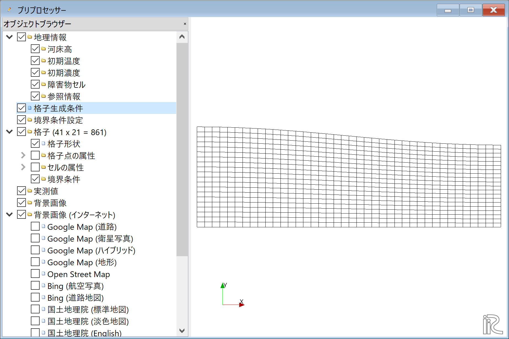

   :格子生成完了

--------------
計算条件の設定
--------------

次に計算条件の設定を行う。メニューバーから「計算条件」→「設定」を選ぶと、
計算条件設定ウィンドウ :numref:`07_jouken_1` が表示される。

.. _07_jouken_1:

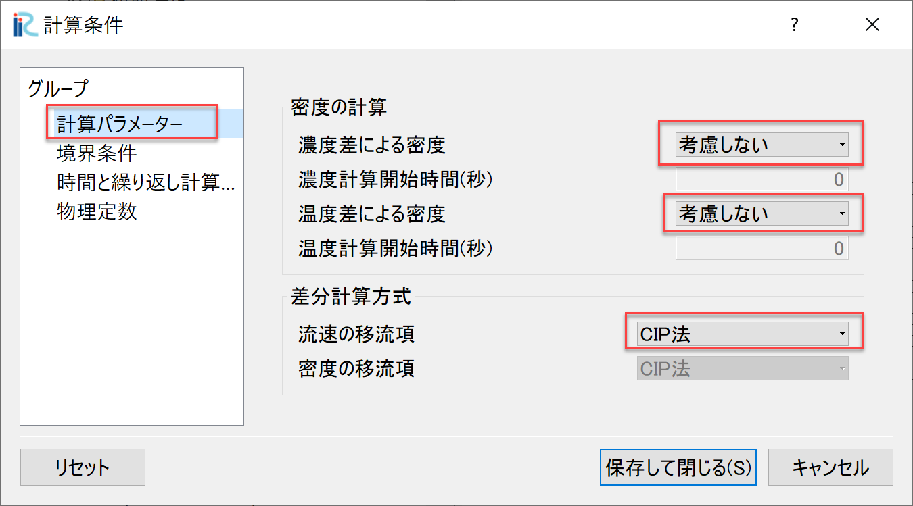

   :計算パラメータ

密度流の計算ではないので「密度の計算」は[考慮しない], 「温度差による密度」も[考慮しない],
「差分計算方法」の「流速の移流項」は[CIP法]とする。

.. _08_jouken_2:

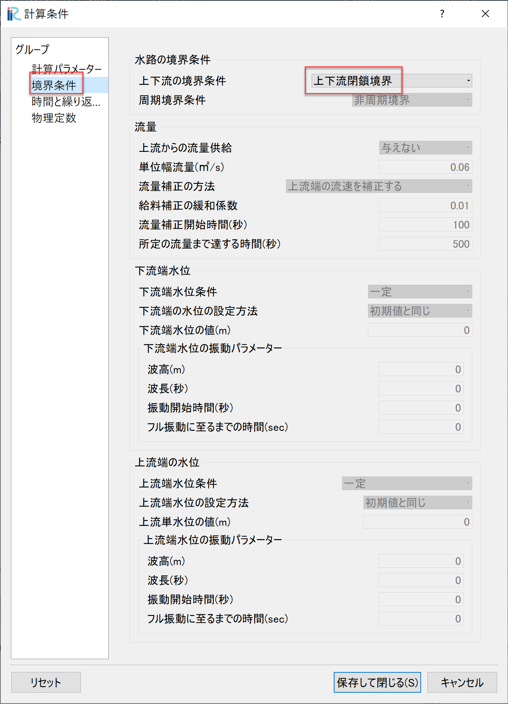

   :初期条件と境界条件

次に、「境界条件」 :numref:`08_jouken_2` に移る。閉鎖水路の水面振動なので、「上下流の境界条件」は
[上下流閉鎖条件]を選び、「時間と繰り返し計算に関するパラメーター」に移動する。

.. _09_jouken_3:

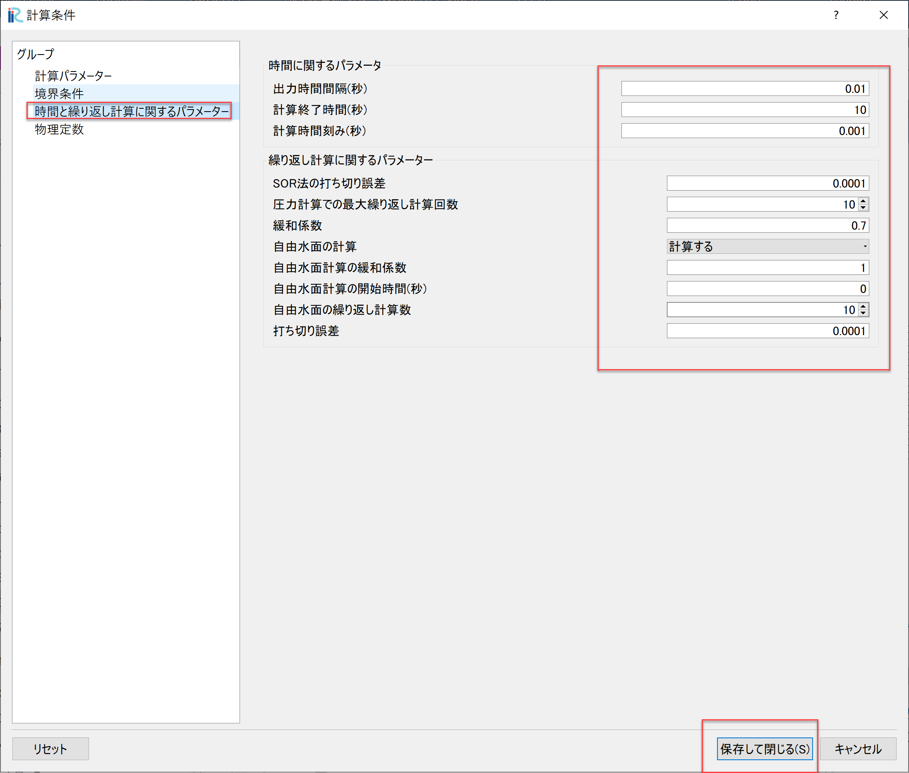

   :時間と繰り返し計算に関するパラメーター

「時間および繰り返し計算に関するパラメーター」 :numref:`09_jouken_3` 図に示したようなパラメータを設定する。なお、
自由水面振動の計算なので、「自由水面の計算」は必ず[計算する]にしておく必要がある。

設定が終わったら[保存して閉じる]を押す。

------------
計算の実行
------------

:numref:`10_keisan` の画面で、メニューバーから[計算]→[実行]を選ぶと、:numref:`11_keisan`
の画面が現れるので、「はい(Y)」を選んで、計算条件を保存しておく。保存はipro形式または、
プロジェクト形式を選択する。

.. _10_keisan:

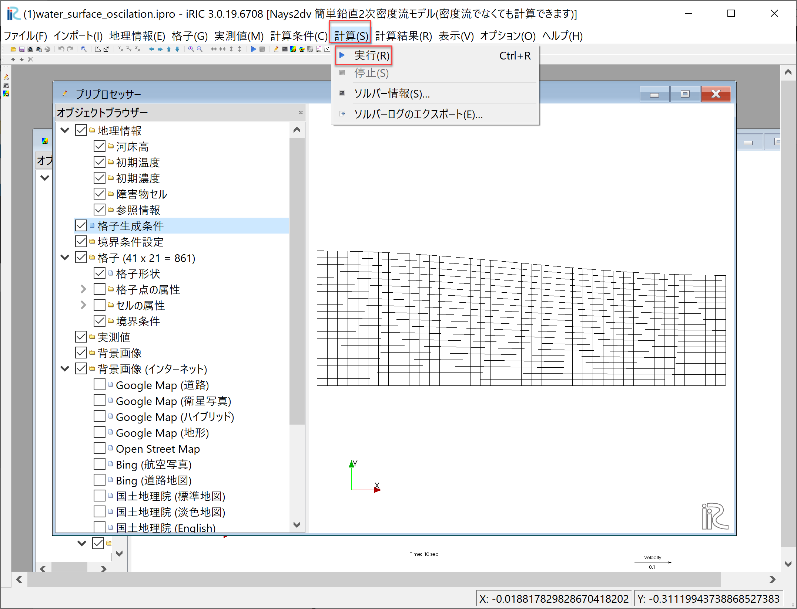

   :計算の実行(1)

.. _11_keisan:

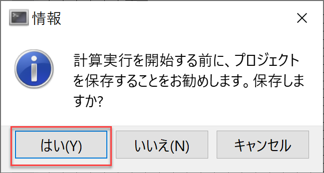

   :保存しますか？

保存が終了すると, :numref:`12_keisan` の画面が現れ、計算が始まる。

.. _12_keisan:

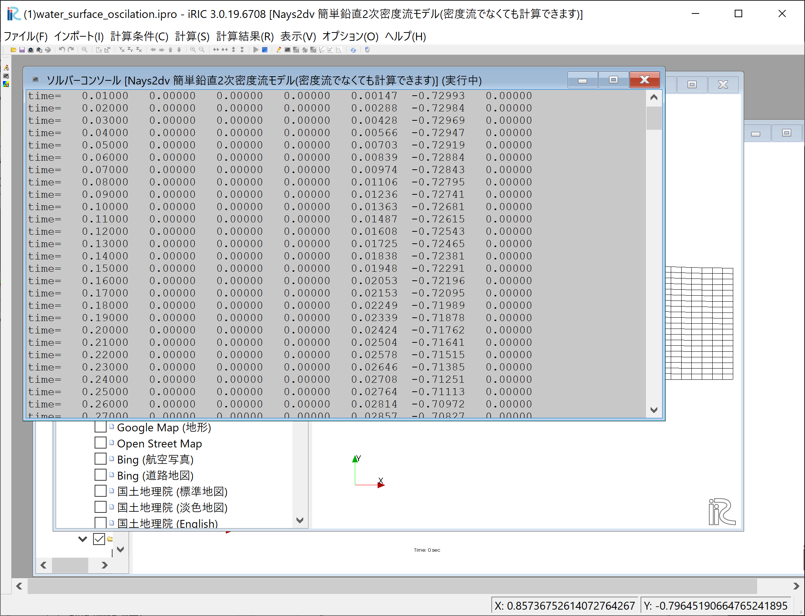

   :計算実行中

計算が終了すると, :numref:`13_keisan` の画面が現るの[OK]を押す。

.. _13_keisan:

.. figure:: images/jikko4.png
   :width: 90%

   :計算終了

-------------------------
計算結果の表示
-------------------------

計算の終了後、:numref:`14_kekka1` の画面で[計算結果]→[新しい可視化ウィンドウ(2D)を開く]を選ぶことによって、
可視化ウィンドウ :numref:`15_kekka2` が現れる。

.. _14_kekka1:

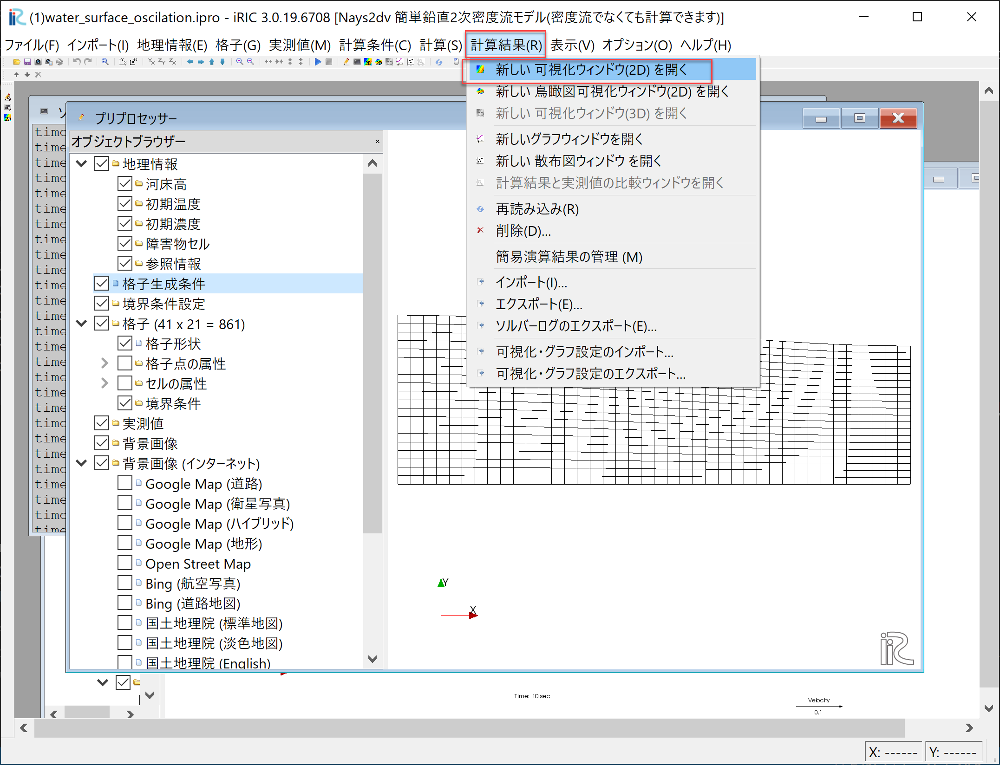

   : 計算結果の表示(1)
 
.. _15_kekka2:

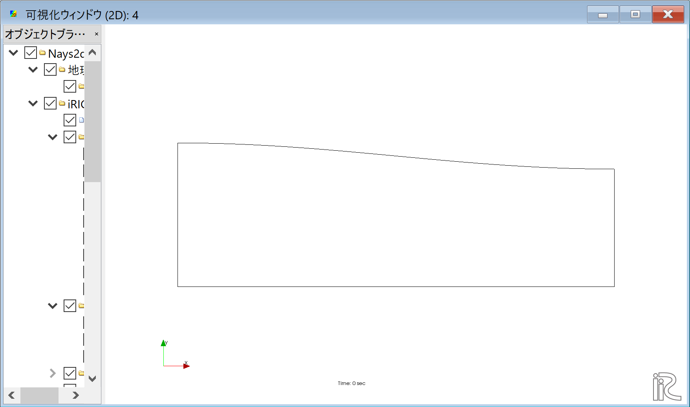

   : 計算結果の表示(2)
 

:numref:`15_kekka2` が現れた段階で,  :numref:`16_kekka3` に示す[アニメーション]→[開始/停止]を押すことにより
水面の振動アニメーションの開始と停止が可能となる。

.. _16_kekka3:

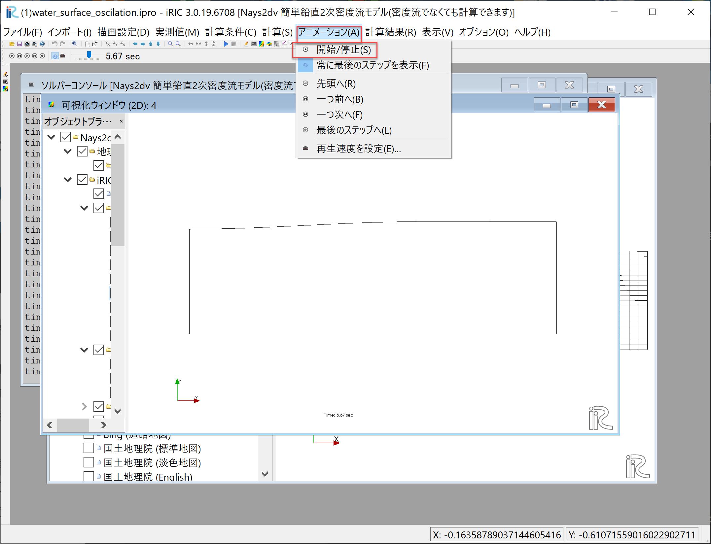

   : 動画の表示
 

なお,マウスのセンターダイヤを回すことにより、拡大・縮小が可能となっている。

^^^^^^^^^^^^^^^
ベクトルの表示
^^^^^^^^^^^^^^^

オブジェクトブラウザーで、[ベクトル]を右クリックして、[プロパティ]をクリックすると、
「ベクトル設定」ウィンドウ :numref:`16_kekka_4` が現れる。

.. _16_kekka_4:

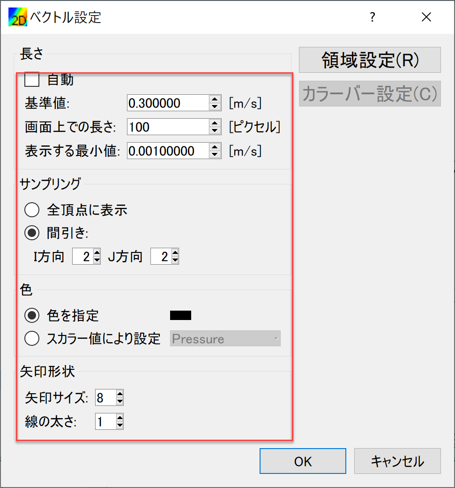

   : ベクトルの設定
 
:numref:`16_kekka_4` の赤囲の部分の設定をして、[OK]をクリックする。 [アニメーション]→[開始/停止]ボタンで、
:numref:`17_kekka_5` のアニメーションが表示される。 [開始/停止]は :numref:`18_kekka_6` 
の赤丸のプレイボタンでも可能である。

.. _17_kekka_5:

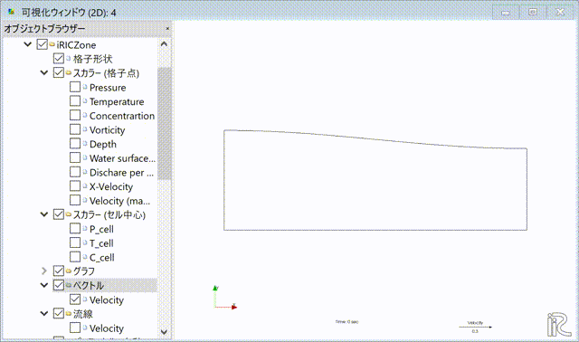

   : ベクトルのアニメーション
 

.. _18_kekka_6:

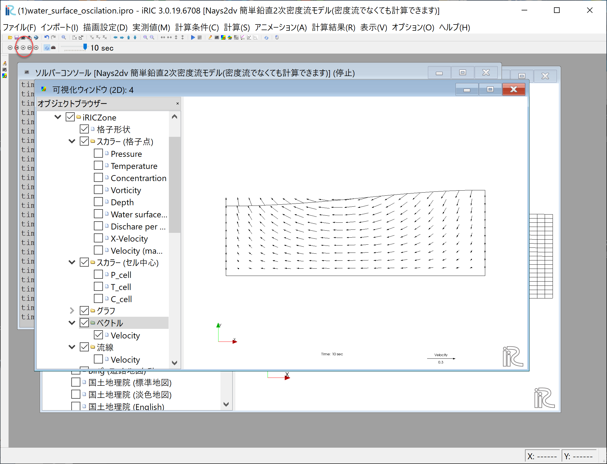

   : ベクトルのアニメーションの開始・停止

^^^^^^^^^^^^
圧力の表示
^^^^^^^^^^^^

オブジェクトブラウザーで、:numref:`19_kekka_7` [スカラー][Pressure]に☑チェックを付て、
ここを右右クリックして、[プロパティ]を選ぶと、
「コンター設定」ウィンドウ :numref:`20_kekka_8` が現れる。ここで、赤丸の設定をして[OK]を
押すと :numref:`21_kekka_9` が表示される。

.. _19_kekka_7:

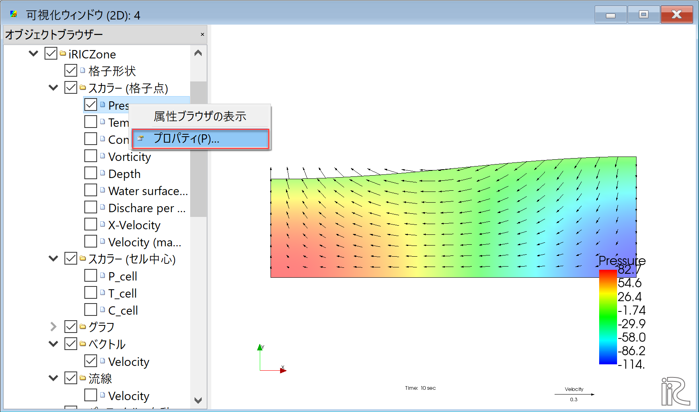

   : 圧力表示
 
.. _20_kekka_8:

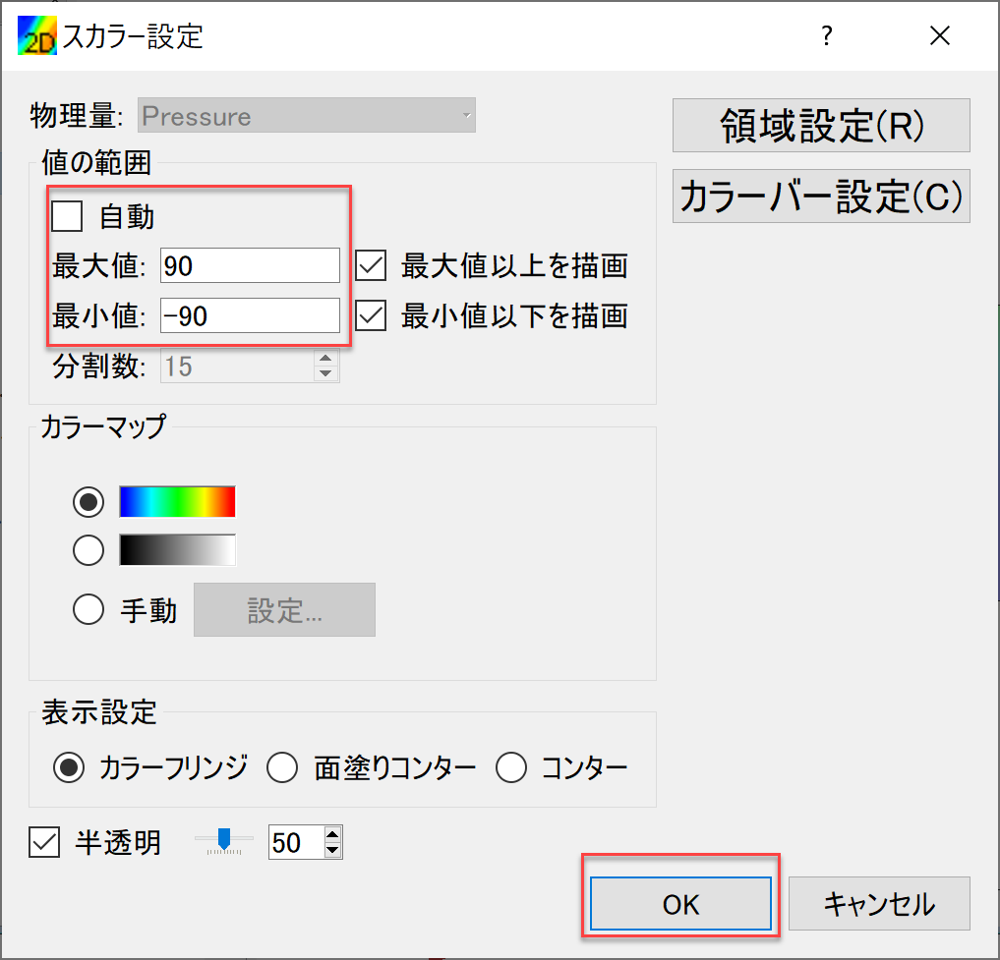

   : 圧力コンターの設定
 
.. _21_kekka_9:

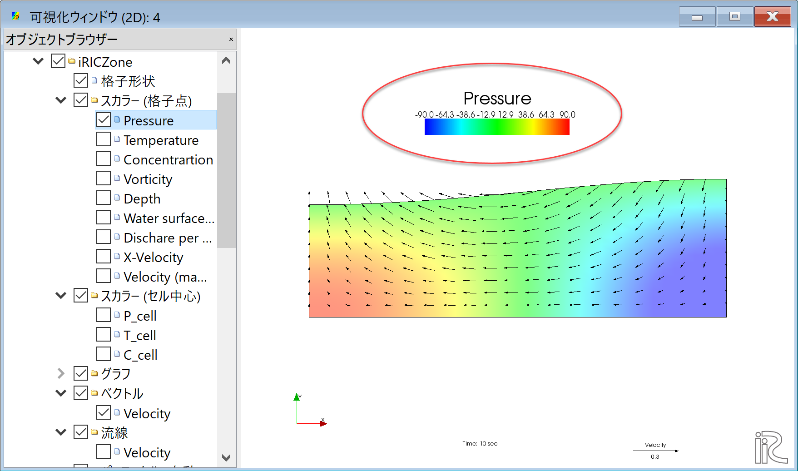

   : 圧力コンター設定終了
 
 
以下、ベクトルと同様にアニメーション表示も出来る。:numref:`22_anime_1` 

.. _22_anime_1:

.. figure:: images/ex1.gif
   :width: 450pt

   : 圧力コンターと流速ベクトルのアニメーション
 