[計算例 2] 密度の異なる流体の混合
=================================

Nays2dvを用いて立方体の中の密度の異なる流体が混合する様子を計算する。

--------------
計算格子の作成
--------------

計算格子の作成はNays2dv専用の格子生成ツールを用いる。 :numref:`03_02_koushi_1` 
で[Nays3dv用格子生成ツール]を選択し。[OK]をクリックする。

.. _03_02_koushi_1:

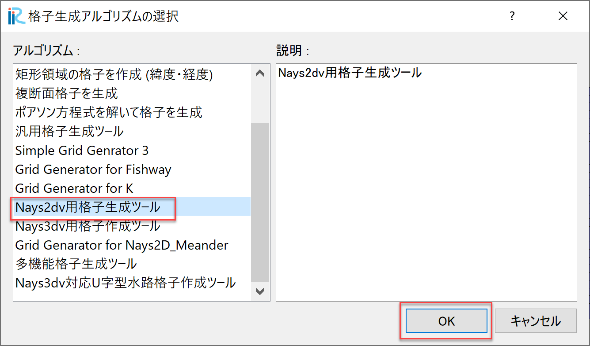

   : 格子生成アルゴリズムの選択

下図の :numref:`03_02_koushi_2` で赤囲いの部分を設定する。

.. _03_02_koushi_2:

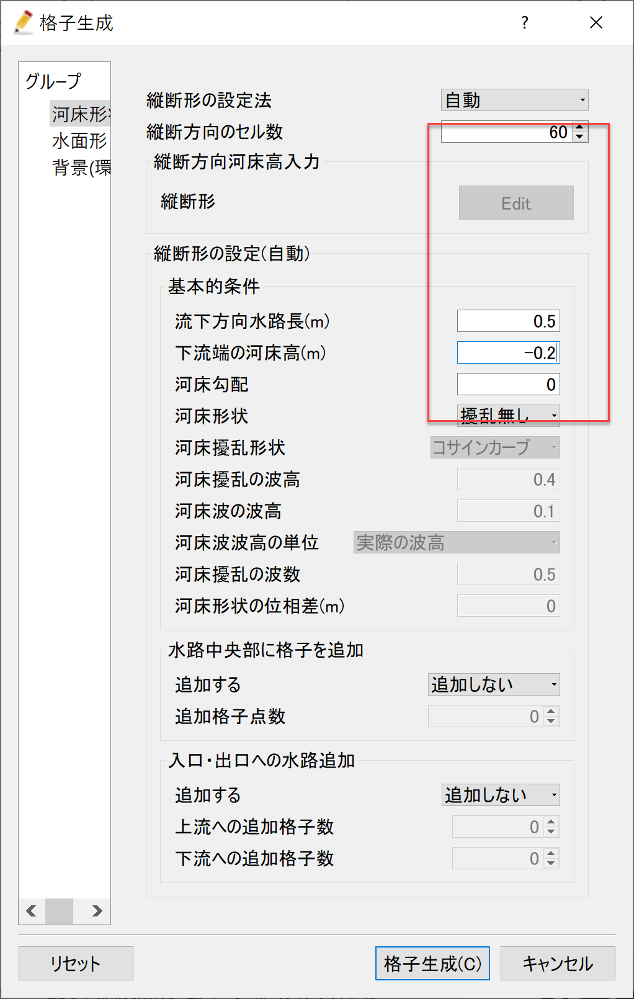

   : 格子生成: 計算領域

グループを「水面形」の変更し、下図 :numref:`03_02_koushi_3` で赤囲いの部分を設定し、格子生成をクリックすると、格子が生成される。
( :numref:`03_02_koushi_4` ) 

.. _03_02_koushi_3:

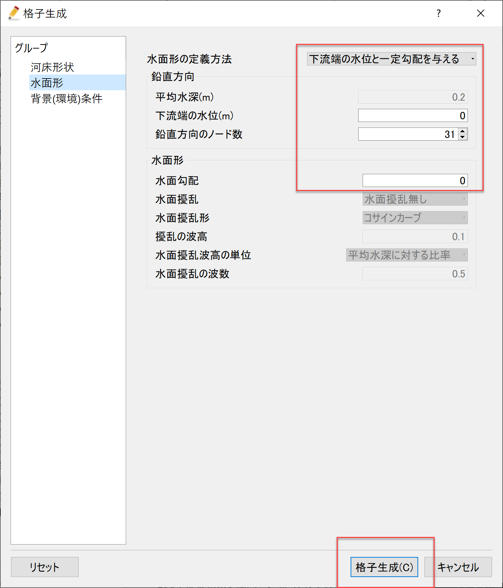

   : 格子生成: 初期水面形

.. _03_02_koushi_4:

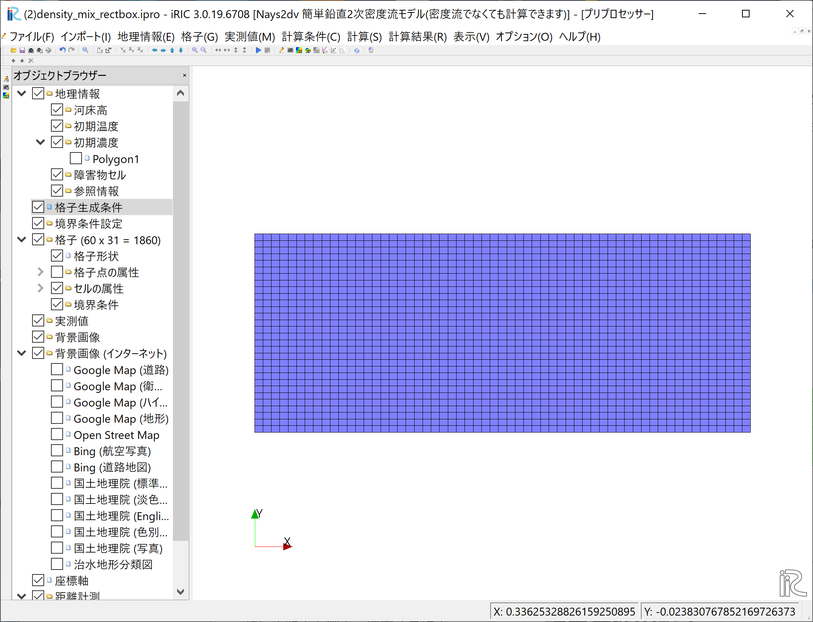

   : 格子生成の完了

下図 :numref:`03_02_koushi_5`　で示すように、 オブジェクトブラウザーで、[格子],[セルの属性],
[初期濃度]にチェックを付けてから、マウス右ボタンで格子全体の半分くらいの範囲を指定して、右クリックして
[値の指定][初期濃度]に「0.03」を指定する。

.. _03_02_koushi_5:

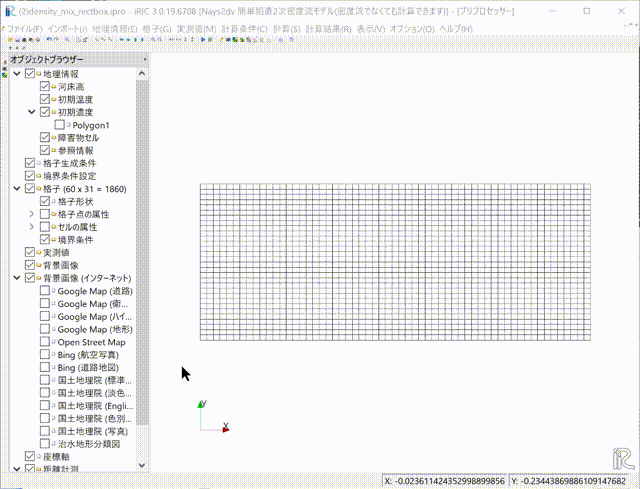

   : 初期濃度の設定

下図 :numref:`03_02_koushi_6` のように、初期濃度を設定した部分の色が変わる。

.. _03_02_koushi_6:

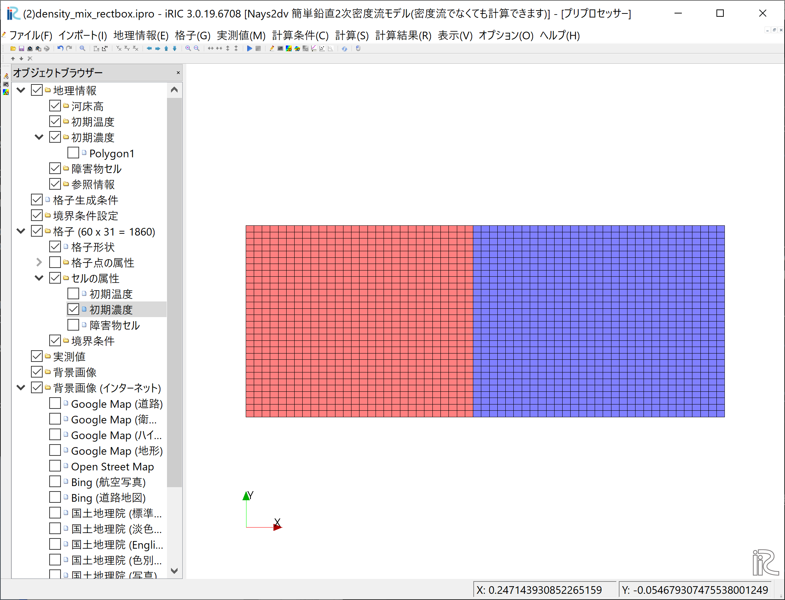

   : 初期濃度の設定終了

--------------
計算条件の設定
--------------

メニューバーから[計算条件]→[設定]を選ぶと「計算条件」入力用のウィンドウが表示される :numref:`03_02_joken_1` 

.. _03_02_joken_1:

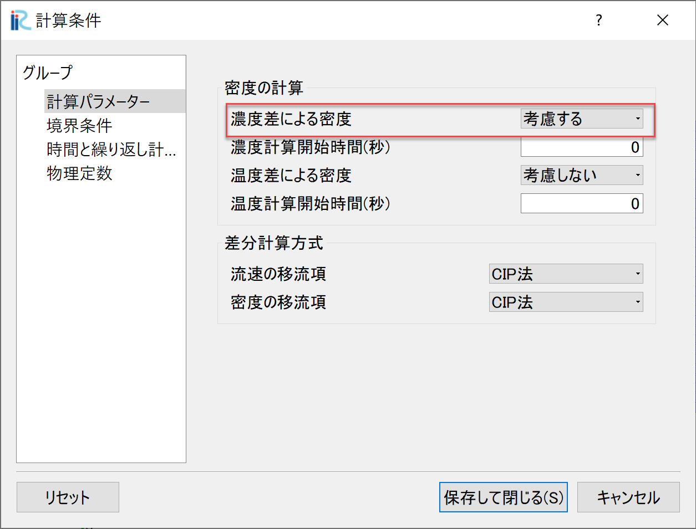

   : 計算条件：モデルパラメータ

「計算条件」ウィンドウ :numref:`03_02_joken_1` の「計算パラメータ」は図の赤で囲った部分を設定する。
本計算は濃度差による密度流なので、「濃度差によ密度流」を[考慮する]に設定する。
差分方式は高精度の[CIP法]を選択する。

.. _03_02_joken_2:

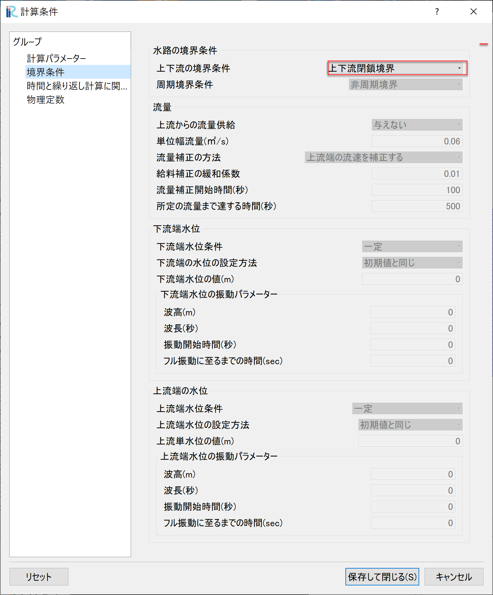

   : 計算条件：境界条件

「計算条件」の「境界条件」は :numref:`03_02_joken_2` のように設定する。
閉鎖水路なので「上下流の境界条件」は[上下流閉鎖境界]とする。

.. _03_02_joken_3:

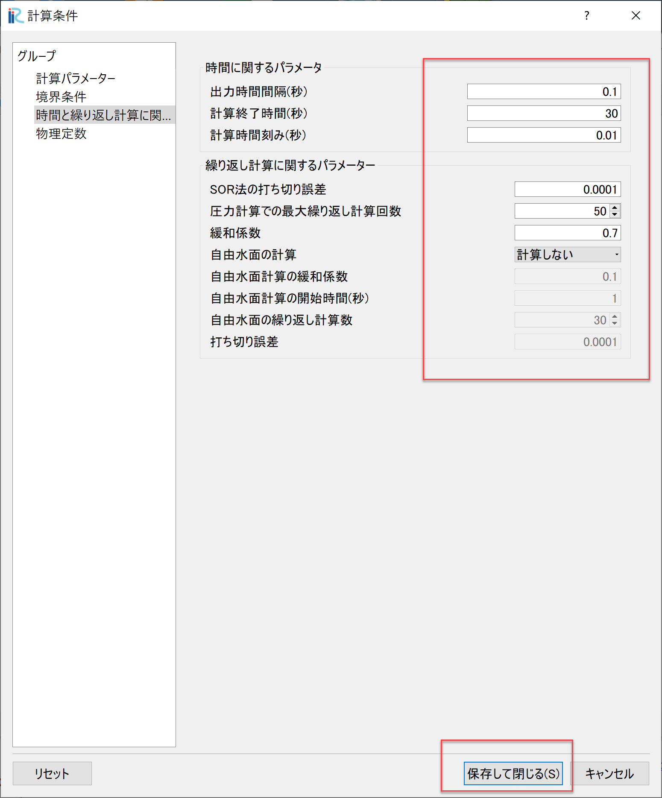

   : 計算条件：時間および繰り返し計算パラメーター

「計算条件」の「時間および繰り返し計算パラメーター」は :numref:`03_02_joken_3` のように設定する。
設定が終了したら[保存して終了]を押す。

------------
計算の実行
------------

.. _03_02_jikkou:

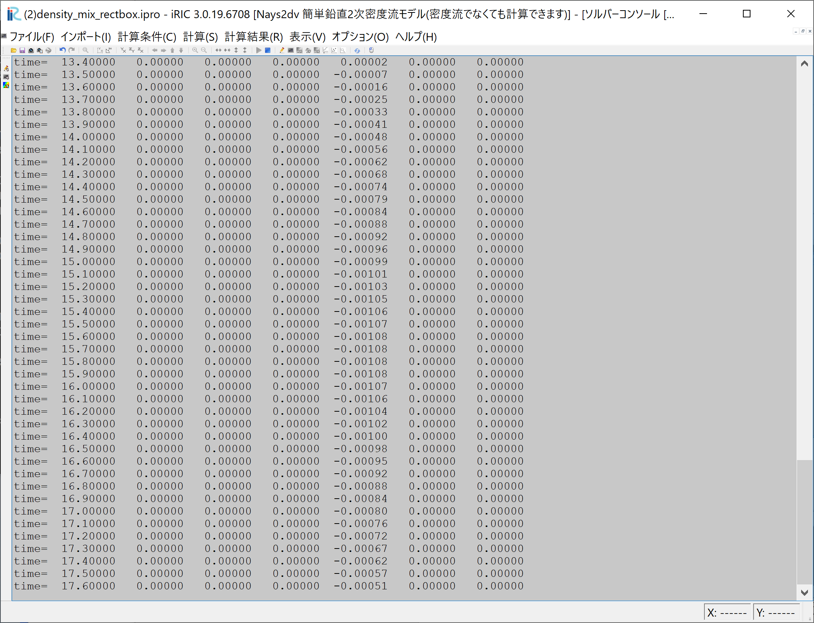

   :計算実行中の画面

[計算]→[実行]を指定すると、:numref:`03_02_jikkou` のような画面が現れ計算が始まる。

.. _03_02_jikkou_1:

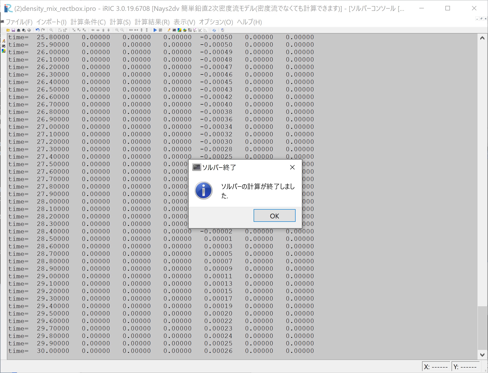

   :計算の終了

計算が終了すると, :numref:`03_02_jikkou_1` のような表示がされるので[OK]をクリックする。

-------------------------
計算結果の表示
-------------------------

計算の終了後、[計算結果]→[新しい可視化ウィンドウ(2D)を開く]を選ぶことによって( :numref:`03_02_kekka_1`),
可視化ウィンドウが現れる( :numref:`03_02_kekka_1`).

.. _03_02_kekka_1:

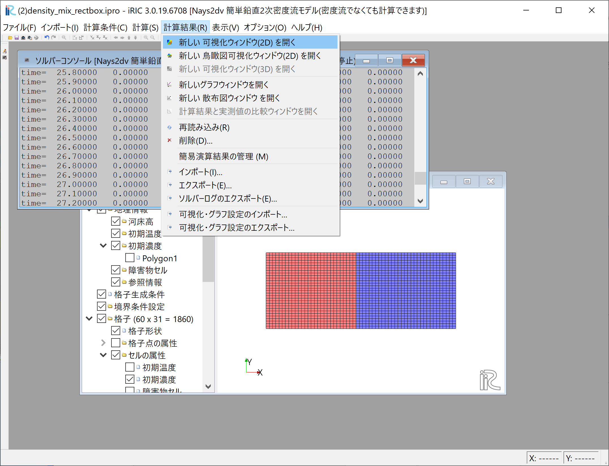

   : 計算結果の表示(1)
 
.. _03_02_kekka_2:

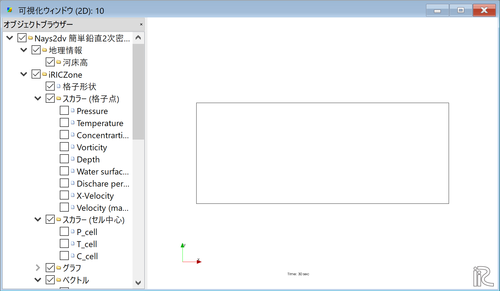

   : 計算結果の表示(2)
 

マウスのセンターダイヤを回すことにより、 拡大・縮小が可能となっている。

^^^^^^^^^^^^^^^^^^^^^^
濃度コンターの表示
^^^^^^^^^^^^^^^^^^^^^^

オブジェクトブラウザーで、[スカラー][Concentration]にチェックマークを入れ、右クリックで、[プロパティ]を
選ぶと、「スカラー設定」ウィンドウ :numref:`03_02_kekka_3` が現れる。

.. _03_02_kekka_3:

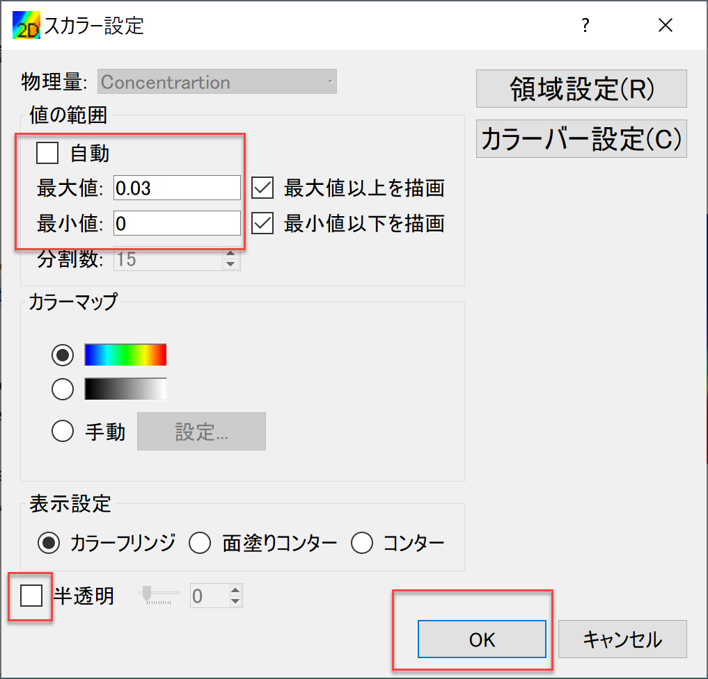

   : スカラー設定
 

:numref:`03_02_kekka_3` のように、「自動」☑を外し、「最大値]を[0.03]に、
「最長値」を[0.00]に設定し、「表示設定」の「半透明」のチェックを外して[OK]を押す.

^^^^^^^^^^^^^^^^^^^^^^^
パーティクルの設定
^^^^^^^^^^^^^^^^^^^^^^^

オブジェクトブラウザーで、[パーティクル][流速]に☑を入れ、[パーティクル]を右クリックして、
「パーティクル設定」ウィンドウを表示させせる。その後、「任意のタイミングで生成」「編集」
「パーティクル」[タイムステップの追加]を選び[0sec]を指定する。
この後、「パーティクルの発生範囲」と「色」「サイズ」を調整して[OK]を押す。
（具体的手順は :numref:`03_02_kekka_4` を参照）

.. _03_02_kekka_4:

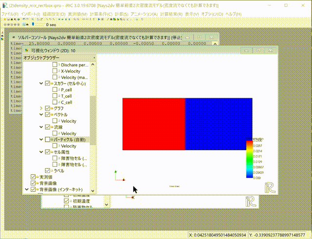

   : パーティクルの設定
 
^^^^^^^^^^^^^^^^^^^^^^^^^^^^^^^^^^
計算結果の表示およびアニメーション
^^^^^^^^^^^^^^^^^^^^^^^^^^^^^^^^^^

「可視化ウィンドウ(3D)」 :numref:`03_02_kekka_5` でタイムバーをゼロに戻して、[アニメーション]→[開始/停止]で
計算結果をアニメーションで見ることが出来る。

.. _03_02_kekka_5:

.. figure:: images/kekka_5.png
   :width: 450pt

   : アニメーション
 

.. figure:: images/ex2.gif

アニメーションはiRICメインウィンドウ左上にあるプレイボタン等で操作も可能である。:numref:`03_02_kekka_6` 

.. _03_02_kekka_6:

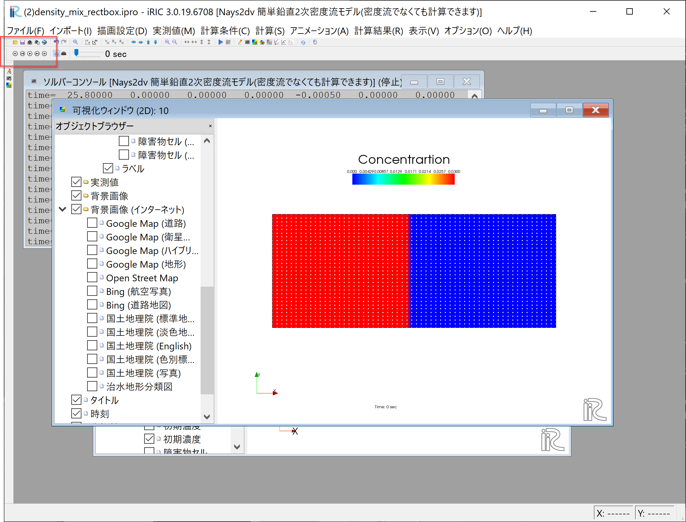

   : アニメーション
 
