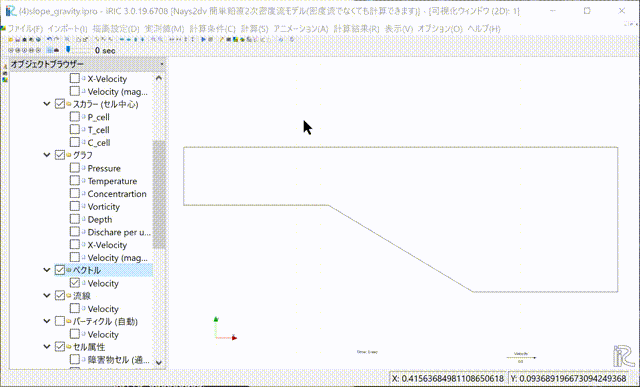

[計算例 4] 斜面を下る密度流
============================================================================

高密度の重たい密度流が斜面を下る様子のシミュレーション。

--------------
計算格子の生成
--------------
計算格子の作成はNays2dv専用の格子生成ツールを用いる。 :numref:`03_04_koshi_1` 
で[Nay2dv用格子生成ツール]を選択し。[OK]をクリックする。

.. _03_04_koshi_1:

.. figure:: images/koshi_1.png
   :width: 400pt

   : 格子生成アルゴリズムの選択

下図の :numref:`03_04_koshi_2` で赤囲いの部分を設定する。 
「縦断形の設定法」を[手動]に、「縦断方向のセル数」を[61]に設定し、
「縦断形」の[Edit]をクリックすると、:numref:`03_04_koshi_3` が表示される。 

.. _03_04_koshi_2:

   : 格子生成: 計算領域

下図 :numref:`03_04_koshi_3` で赤囲いの部分を設定し、[OK]をクリックすると、 :numref:`03_04_koshi_2` 
に戻るので、「水面形」をクリックして :numref:`03_04_koshi_4` の赤囲いの部分を設定して、[格子生成]
をクリックすると、 :numref:`03_04_koshi_5` が現れ、「マッピングしますか？」と聞かれるので、
[はい(Y)]を選択すると、格子生成が完了する。

.. _03_04_koshi_3:

   : 格子生成： 縦断形の手動入力

.. _03_04_koshi_4:

   : 格子生成： 水面形

.. _03_04_koshi_5:

   : マッピング

--------------
初期濃度の設定
--------------

:numref:`03_04_cell` に示すようにオブジェクトブラウザーで,「格子」「セルの属性」「初期濃度」
にチェックマークを付けて「初期濃度」を左クリックして強調してから、初期濃度を設定したい範囲をマウスで
範囲指定し、右クリック「値の編集」で[0.03]を入力する。これにより、対象範囲の色が変わって初期濃度が
[0.03]に設定される。

.. _03_04_cell:

   : 初期濃度の設定

--------------
計算条件の設定
--------------

メニューバーから[計算条件]→[設定]を選ぶと「計算条件」入力用のウィンドウが表示される :numref:`03_04_joken_1` 

.. _03_04_joken_1:

   : 計算条件：モデルパラメータ

ウィンドウ :numref:`03_04_joken_1` の「計算パラメータ」で、
本計算は濃度差による密度流なので、「濃度差による密度」を[考慮する]に設定する。

.. _03_04_joken_2:

   : 計算条件：濃度の初期条件と境界条件

「境界条件」は、
:numref:`03_04_joken_2` の赤囲いのように、「上下流の境界条件」を[上下流閉鎖境界]
に設定する。

.. _03_04_joken_3:

   : 計算条件：時間と繰り返し計算に関するパラメーター

「時間と繰り返し計算に関するパラメーター」は、
:numref:`03_04_joken_3` の赤囲いのように設定する。「自由水面の計算」は
[計算しない]に設定する。

設定が終了したら、[保存して閉じる]を押す。

------------
計算の実行
------------

.. _03_04_jikko_1:

   :計算実行中の画面

[計算]→[実行]を指定すると、:numref:`03_04_jikko_1` のような画面が現れ計算が始まる。

.. _03_04_jikko_2:

.. figure:: images/jikko_2.png
   :width: 45%

   :計算の終了

計算が終了すると, :numref:`03_04_jikko_2` のような表示がされる。

-------------------------
計算結果の表示
-------------------------

計算の終了後、[計算結果]→[新しい可視化ウィンドウ(2D)を開く]を選ぶことによって、可視化ウィンドウ(3D)が現れる。

.. _03_04_kekka_1:

   : 計算結果の表示
 

「Ctrl」ボタンとマウス左ボタンを押しながらマウスを上下左右に動かすことによって移動が、
マウスぼセンターダイヤを回すことにより, :numref:`03_04_kekka_2` のような
拡大・縮小が可能となっている。

.. _03_04_kekka_2:

   : 計算結果の移動・拡大・縮小
 

^^^^^^^^^^^^^^^^^^^^^^^^^^^
ベクトル表示の設定と表示
^^^^^^^^^^^^^^^^^^^^^^^^^^^

オブジェクトブラウザーで、[ベクトル][Velocity]にチェックマークを入れて、
「ベクトル」を右クリックして、「プロパティ」選択すると、
「ベクトル設定」ウィンドウ :numref:`03_04_kekka_3` が現れる。

.. _03_04_kekka_3:

   : ベクトルの設定
 

:numref:`03_04_kekka_3` のようにベクトルに関する各パラメータを設定し、[OK]ボタンを押す。
メニューバーから「アニメーション」「開始/停止」をクリックすることにより。
:numref:`03_04_vec` のようなアニメーションが表示される。

.. _03_04_vec:

   : ベクトルアニメーションの表示
 

^^^^^^^^^^^^^^^^^^^^^^^^^^^^^
濃度コンターの設定および表示
^^^^^^^^^^^^^^^^^^^^^^^^^^^^^

オブジェクトブラウザーで、一旦「ベクトル」チェックマークを外し、
「スカラー」[Concentration]にチェックマークを入れて、[Concentration]を右クリックし、
プロパティを選択すると、「スカラー設定」ウィンドウ :numref:`03_04_kekka_4` が現れる。 
「自動」チェックマークを外し、「最大値」を[0.03]、「最小値」を[0.00]に設定し、
「半透明」のチェックマークを外し、[OK]ボタンを押す。

.. _03_04_kekka_4:

   : 等値面の表示
 
ベクトルと同様に、メニューバーから「アニメーション」「開始/停止」をクリックすることにより。
:numref:`03_04_conc` のようなアニメーションが表示される。

.. _03_04_conc:

   : 濃度分布アニメーションの表示
 

^^^^^^^^^^^^^^^^^^^^^^^^^^^^
パーティクル表示の設定と表示
^^^^^^^^^^^^^^^^^^^^^^^^^^^^

オブジェクトブラウザーで、[パーティクル][流速]に☑を入れ、[パーティクル]を右クリックして、
「パーティクル設定」ウィンドウを表示させせる。その後、「任意のタイミングで生成」「編集」
「パーティクル」[タイムステップの追加]を選び[0sec]を指定する。
この後、「パーティクルの発生範囲」と「色」「サイズ」を調整して[OK]を押す。
（具体的手順は :numref:`03_04_particle` を参照）

.. _03_04_particle:

   : パーティクルの設定と表示

^^^^^^^^^^^^^^^^^^^^^^^^^^^^^^^^^^
計算結果の表示およびアニメーション
^^^^^^^^^^^^^^^^^^^^^^^^^^^^^^^^^^

「可視化ウィンドウ(2D)」 :numref:`03_04_kekka_5` でタイムバーをゼロに戻して、[アニメーション]→[開始/停止]で
計算結果をアニメーションで見ることが出来る。

.. _03_04_kekka_5:

   : アニメーション
 

.. figure:: images/ex4.gif

アニメーションはiRICメインウィンドウ左上にあるプレイボタン等で操作も可能である。:numref:`03_04_kekka_6` 

.. _03_04_kekka_6:

   : アニメーション
 

 

