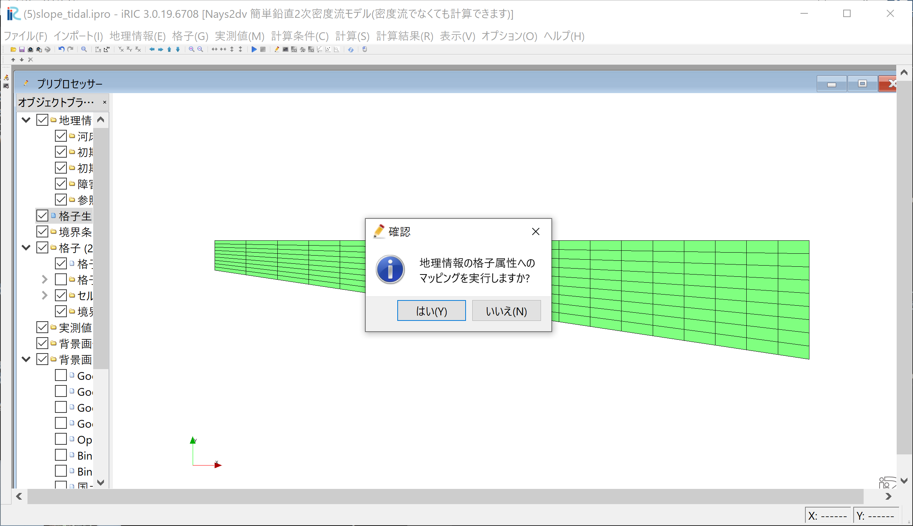

[計算例 5] 一定勾配水路・定常流量下での下流端水位変動を伴う流れ
============================================================================

感潮河川では、潮の干満により河口水位が上下に振動し、これが河川流に影響を及ばす。
ここでは、単純な水路を想定し、下流端の水位変動を伴う流れの計算を行う。

---------------
計算格子の生成
---------------

計算格子の作成はNays2dv専用の格子生成ツールを用いる。 :numref:`03_05_koshi_1` 
で[Nays2dv用格子生成ツール]を選択し。[OK]をクリックする。

.. _03_05_koshi_1:

.. figure:: images/koshi_1.png
   :width: 400pt

   : 格子生成アルゴリズムの選択

「格子生成」ウィンドウが現れるので、 :numref:`03_05_koshi_2` の「グループ」「河床形状」
で赤囲いの部分を設定する。これにより一定勾配の水路が設定される。

.. _03_05_koshi_2:

   : 格子生成: 河床形状

次に、「グループ」「水面形」を選び。 :numref:`03_05_koshi_3` で赤囲いの部分を設定する。
これで、初期水面形は水平な条件となる。設定が終わったら[格子生成]をクリックする。

.. _03_05_koshi_3:

   : 格子生成： 水面形

「マッピングを実行しますか？」と聞かれるので[はい(Y)]をクリックする
( :numref:`03_05_koshi_4` ) .

.. _03_05_koshi_4:

   : 格子生成： マッピング

--------------
計算条件の設定
-------------- 

メニューバーから[計算条件]→[設定]を選ぶと「計算条件」入力用のウィンドウが表示される :numref:`03_05_joken_1` 
「流速計算の移流項」は[風上差分]を選ぶ。

.. _03_05_joken_1:

.. figure:: images/joken_1.png
   :width: 400pt

   : 計算条件：計算条件

「計算条件」「グループ」「境界条件」を選ぶと :numref:`03_05_joken_2` 
が表示されるので、
「上下流の境界条件」は[上下流自由境界]、
「上流からの流量供給」は[与える]、
「単位幅流量」は[0.01]とする。この時、流量を急激に与えると計算が安定しないので、
ゼロから時間をかけて緩和係数で調節しながら増加させる。また、流量は直接与えるのではなく。
上流側の水面勾配を調節しながら所定の流量になるように調節する。
以上より、
「流量補正の方法は」[上流端で水面勾配を補正]、
「流量の緩和係数」は[0.01]、
「所定の流量まで達する時間]は[200]秒とした。

「下流端の水位は」[サインカーブ振動]とし、 :numref:`03_05_joken_2` に示すパラメータで
与えた。

.. _03_05_joken_2:

   : 計算条件：境界条件

.. _03_05_joken_3:

   : 計算条件：時間およに繰り返し計算パラメーター

「計算条件」の「時間と繰り返し計算に関するパラメーター」は :numref:`03_05_joken_3` 
の赤囲いのように設定すし。設定が終わったら[保存して終了」をクリックする。

------------
計算の実行
------------

.. _03_05_jikko_1:

   :計算実行中の画面

[計算]→[実行]を指定すると、:numref:`03_05_jikko_1` のような画面が現れ計算が始まる。

.. _03_05_jikko_2:

.. figure:: images/jikko_2.png
   :width: 45%

   :計算の終了

計算が終了すると, :numref:`03_05_jikko_2` のような表示がされる。

-------------------------
計算結果の表示
-------------------------

ベクトルやスカラー量のコンター表示は前章までの説明と同じなので省略し、ここでは
グラフの表示法について説明する. :numref:`03_05_kekka_1` に示すように、 
メニューバーから、[計算結果]→[新しいグラフウィンドウを開く]で、
「データーソース設定」ウィンドウが現れる。

.. _03_05_kekka_1:

   : 計算結果の表示(1)
 

.. _03_05_kekka_2:

   : データソース設定(1)

:numref:`03_05_kekka_2` で[Downstream Water Surface Elevation](下流端水位)
を選んで[追加]を押すと。:numref:`03_05_kekka_3` のように[Downstream Water Surface Elevation]
が左に移動する。

 
Z方向の表示を拡大したい場合は、メニューバーから[表示]→[Z方向の倍率]を選んで、( :numref:`03_05_kekka_3` ) 

.. _03_05_kekka_3:

   : データソース設定(2)
 

ここで、[OK]をクリックすると、 :numref:`03_05_kekka_4` に示すような、
下流端水位の時間変化グラフが表示される。

任意の倍率(ここでは2)を入力して、[OK]を押す。( :numref:`03_05_kekka_4` ) 

.. _03_05_kekka_4:

   : 下流端水位の時間変化グラフ

 
-------------------------
アニメーションの表示
-------------------------

上記説明した「グラフウィンドウ」と、本省では説明を省略した「可視化ウィンドウ(2D)」 
を上下に並べて、メニューバーのタイムバーをゼロに戻して、[アニメーション]→[開始/停止]で
計算結果をアニメーションで２つのウィンドウを同時にアニメーションで見ることが出来る。

.. _03_05_kekka_7:

   : アニメーション
 

アニメーションはiRICメインウィンドウ左上にあるプレイボタン等で操作も可能である。:numref:`03_05_kekka_8` 

.. _03_05_kekka_8:

   : アニメーション
 

.. _03_05_ex5:

   : アニメーション
 