[計算例 6] 一定勾配水路への塩水楔の侵入
============================================================================

感潮河川では、潮の干満により河口水位が上下に振動し、これが河川流に影響を及ばす。
ここでは、単純な水路を想定し、下流端の水位変動による塩水楔の挙動を計算する。

---------------
計算格子の生成
---------------

計算格子の作成はNays2dv専用の格子生成ツールを用いる。 :numref:`03_06_koshi_1` 
で[Nays2dv用格子生成ツール]を選択し。[OK]をクリックする。

.. _03_06_koshi_1:

.. figure:: images/koshi_1.png
   :width: 400pt

   : 格子生成アルゴリズムの選択

「格子生成」ウィンドウが現れるので、 :numref:`03_06_koshi_2` の「グループ」「河床形状」
で赤囲いの部分を設定する。これにより一定勾配の水路が設定される。

.. _03_06_koshi_2:

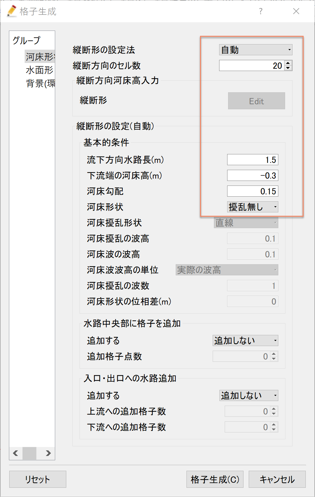

   : 格子生成: 河床形状

次に、「グループ」「水面形」を選び。 :numref:`03_06_koshi_3` で赤囲いの部分を設定する。
これで、初期水面形は水平な条件となる。設定が終わったら[格子生成]をクリックする。

.. _03_06_koshi_3:

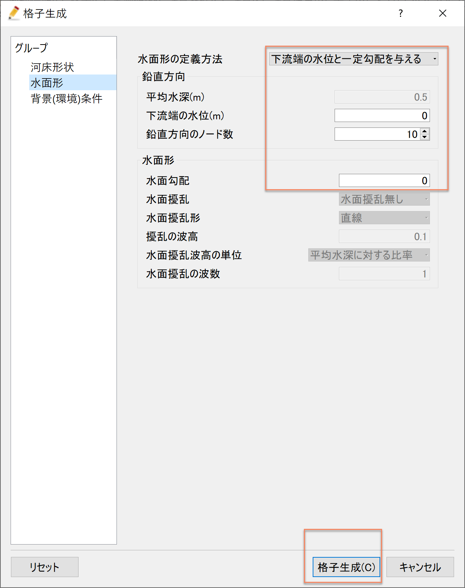

   : 格子生成： 水面形

「マッピングを実行しますか？」と聞かれるので[はい(Y)]をクリックする
( :numref:`03_06_koshi_4` ) .

.. _03_06_koshi_4:

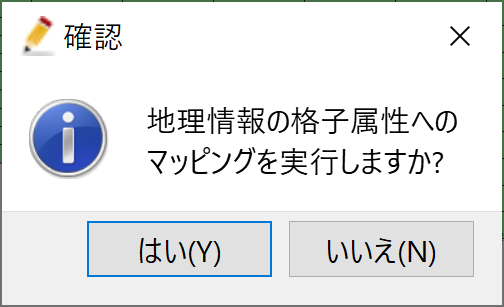

   : 格子生成： マッピング

-------------------
濃度境界条件の設定
-------------------

下流端において塩水の境界条件を設定する。
:numref:`03_06_kyokai_1` に示すように、オブジェクトブラウザーで「境界条件設定」にチェックマーク☑を入れて右クリックし、
「濃度境界の追加」を選ぶ。その後。下流端の境界エッジに沿って範囲を指定し、終了時
に「Enter」を打ち込むことにより現れる「境界条件」
ウィンドウ（ :numref:`03_06_kyokai_2` )で必要な情報を入力し[OK]ボタンを押す。

.. _03_06_kyokai_1:

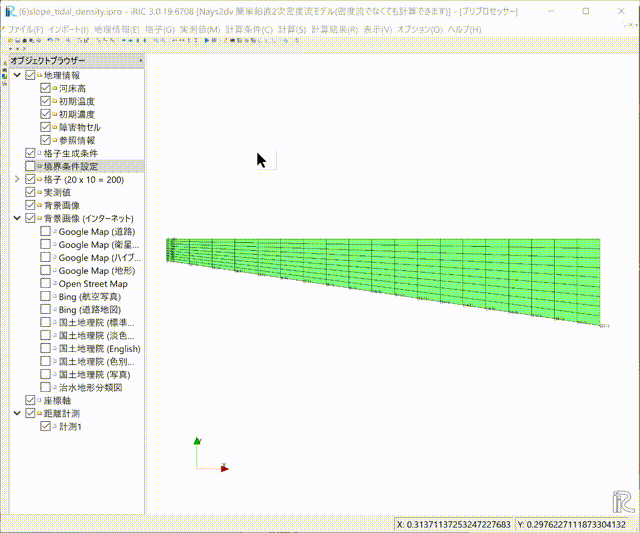

   : 格子生成： 濃度境界の追加

.. _03_06_kyokai_2:

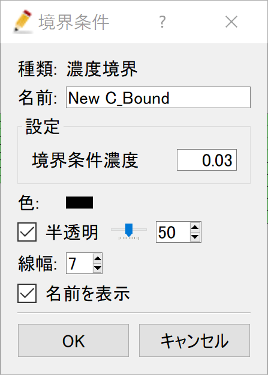

   : 格子生成： 濃度境界条件の設定

指定した境界条件を格子情報へマッピングを行う。
メニューバーから「格子」「マッピング」「実行」を :numref:`03_06_kyokai_3` に示すように
選択し実行する。

.. _03_06_kyokai_3:

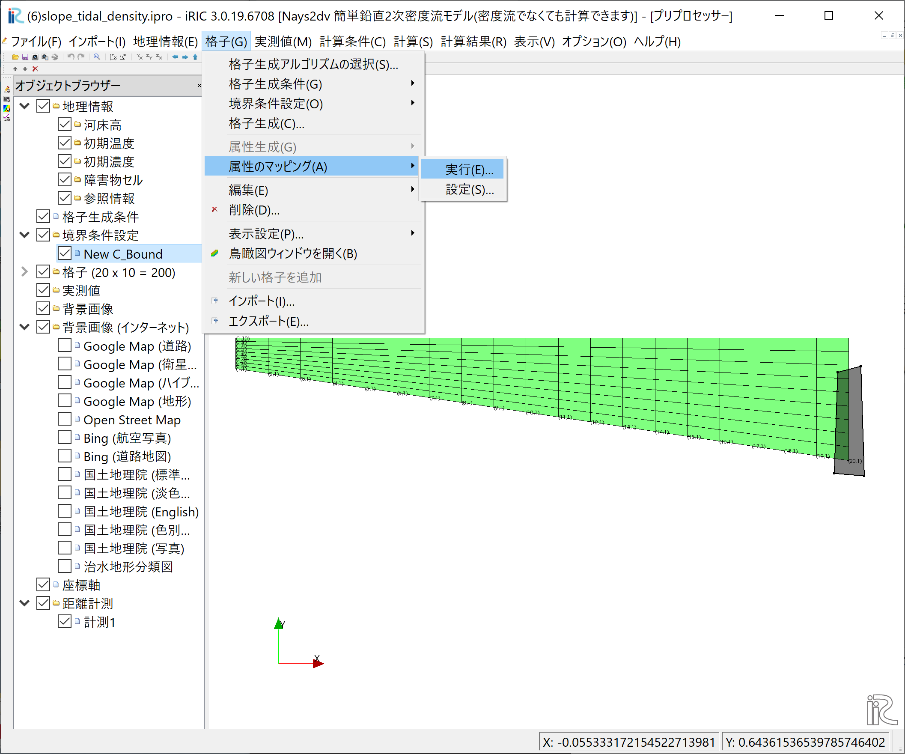

   : 格子生成： 濃度境界条件のマッピング(1)

:numref:`03_06_kyokai_4` のウィンドウが表示されるので「New C_Bound」に☑マーク
を入れて[OK]を押すと。

.. _03_06_kyokai_4:

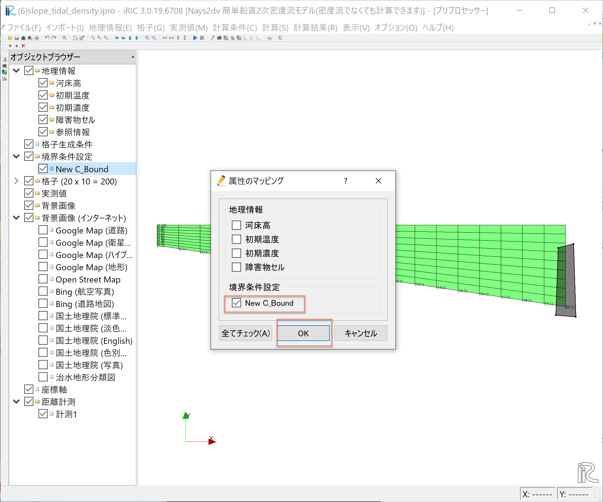

   : 格子生成： 濃度境界条件のマッピング(2)

--------------
計算条件の設定
--------------

メニューバーから[計算条件]→[設定]を選ぶと「計算条件」入力用のウィンドウが表示される :numref:`03_06_joken_1` 
「差分計算方式」は「流速の移流項」も「密度の移流項」も[風上差分]を選ぶ。

.. _03_06_joken_1:

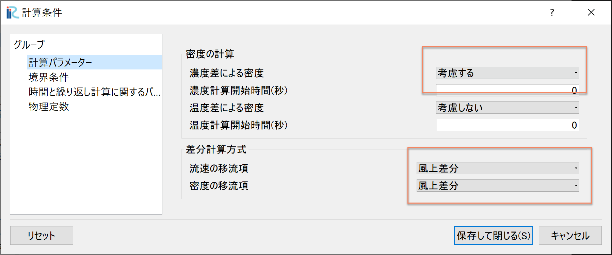

   : 計算条件：計算条件

「計算条件」「グループ」「境界条件」を選ぶと :numref:`03_06_joken_2` 
が表示されるので、
「上下流の境界条件」は[上下流自由境界]、
「上流からの流量供給」は[与えない]を選ぶ。

「下流端の水位は」[サインカーブ振動]とし、 :numref:`03_06_joken_2` に示すパラメータで
与える。

.. _03_06_joken_2:

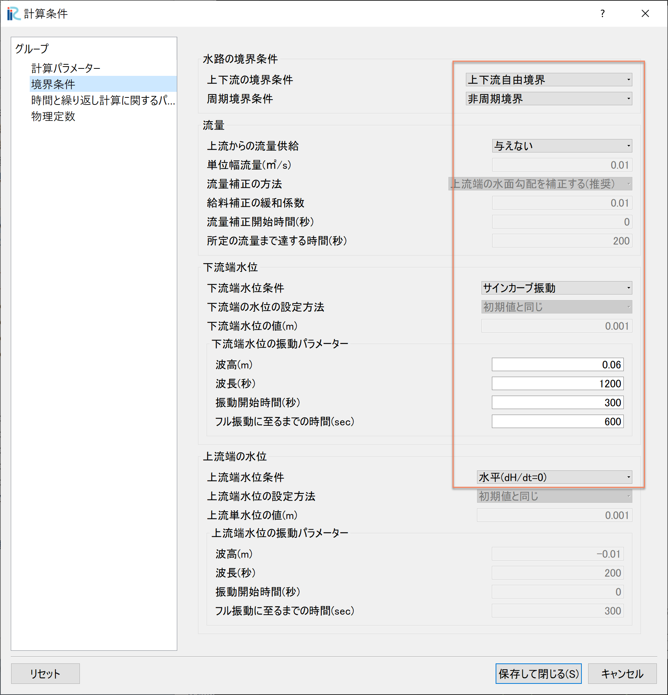

   : 計算条件：境界条件

.. _03_06_joken_3:

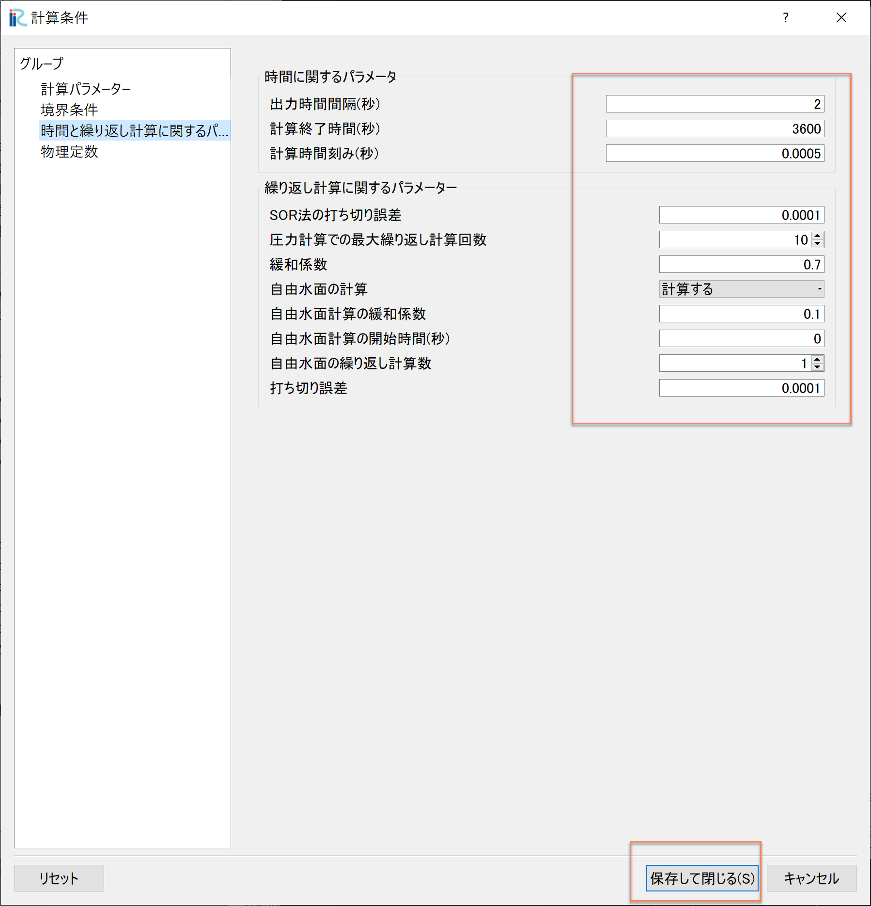

   : 計算条件：時間およに繰り返し計算パラメーター

「計算条件」の「時間と繰り返し計算に関するパラメーター」は :numref:`03_06_joken_3` 
の赤囲いのように設定すし。設定が終わったら[保存して終了」をクリックする。

------------
計算の実行
------------

.. _03_06_jikko_1:

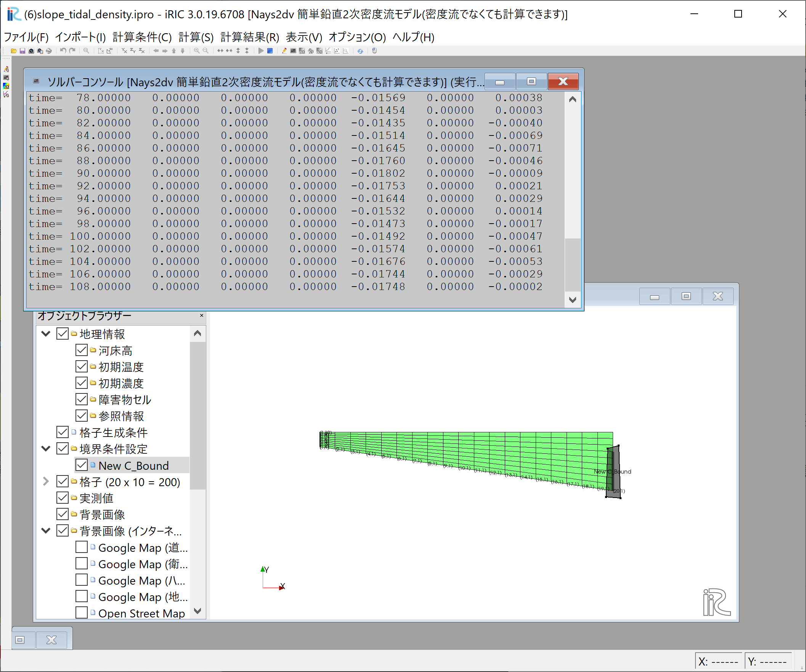

   :計算実行中の画面

[計算]→[実行]を指定すると、:numref:`03_06_jikko_1` のような画面が現れ計算が始まる。

.. _03_06_jikko_2:

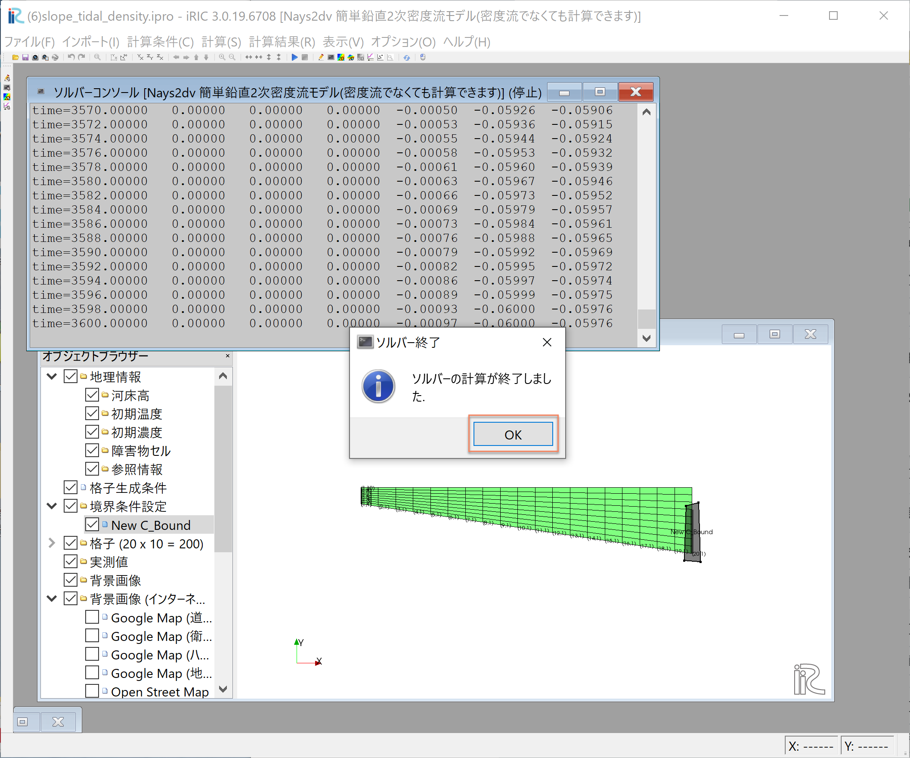

   :計算の終了

計算が終了すると, :numref:`03_06_jikko_2` のような表示がされるので、[OK]をクリックして
計算終了する。

-------------------------
計算結果の表示
-------------------------

ベクトルやスカラー量のコンター表示、水位等のグラフ表示は前章までの説明と同じなので
ここでは結果のみ表示する。:numref:`03_06_kekka_1` は(塩分)濃度コンターと流速ベクトルのア二メーション。

.. _03_06_kekka_1:

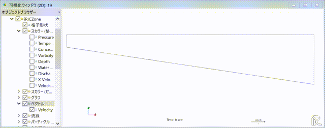

   :流速ベクトルと濃度コンター表示

:numref:`03_06_kekka_2` はベクトル・コンターと下流端水位変動を一緒に表示した動画
である。

.. _03_06_kekka_2:

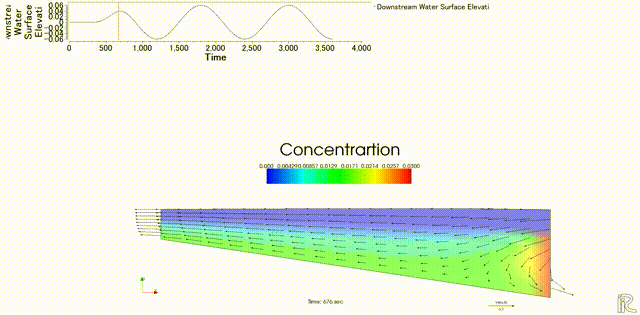

   :流速ベクトルと濃度コンター表示

